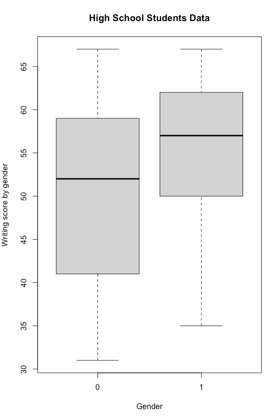

# Demonstration 1
Complete the following demonstration in RStudio. All the sections below match those in Xia et al. (2018), Chapter 4: Introduction to R, RStudio and ggplot2. Review them to interpret scripts and outcomes of your analyses

# 4.1. Introduction to R and RStudio
## 4.1.1 Installing R, RStudio, and R Packages    
```r
# Check citation for packages and RStudio
citation ()
RStudio.Version()
install.packages("ALDEx2")  
library(ALDEx2)
citation ("ALDEx2")

# see what packages are installed

installed.packages()
installed.packages()[1:5,]

# To see whether or not a specific package (e.g., ALDEx2) is already installed

a<-installed.packages()
packages<-a[,1] 
is.element("ALDEx2", packages)
# [1] TRUE
```

## 4.1.2 Set Working Directory in R
```r
getwd()
# Set Working Directory in R to a file of your choice
setwd("your working directory") 
# check your new working directory
getwd() 
```

## 4.1.3 Data Analysis Through RStudio
```r
setwd("your working directory")

# working directory for my files
setwd("your working directoty")
# list files in working directory
list.files()
```

## 4.1.4 Data Import and Export
```r
tab <- read.table("hsb2demo.csv", header=TRUE,row.names=1, sep=",")
head(tab)
tab <- read.table("hsb2demo.txt", header=TRUE,row.names=1, sep="\t") 
head(tab)
raw<- "https://raw.githubusercontent.com/chvlyl/PLEASE/master/1_Data/Raw_Data/MetaPhlAn/PLEASE/
G_Remove_unclassfied_Renormalized_Merge_Rel_MetaPhlAn_Result.xls"  
tab <- read.table(raw,sep='\t',header=TRUE,row.names = 1,check.names=FALSE,stringsAsFactors=FALSE)
head(tab)

tab <- read.delim("hsb2demo.txt", header=T, row.names=1) 
head(tab)
tab <- read.csv('hsb2demo.csv', head = T, row.names = 1, sep = ',', dec = '.')
head(tab)
tab <- read.table (file = 'hsb2demo.csv', head = T, row.names = 1, sep = ',', dec = ',')
head(tab)
```

## Boxplot of writing score by gender 
```r
boxplot(write ~ female,data=tab, main="High School Students Data", 
        xlab="Gender", ylab="Writing score by gender")
```

## Package readxl for reading excell files
```r
install.packages ("readxl")
library(readxl)
tab <- read_xlsx("hsb2demo.xlsx",sheet=1)
head(tab)
```

## Export data files
```r
tab <- read.table("hsb2demo.csv", header=TRUE,row.names=1, sep=",")
head(tab)
write.table(tab, file="hsb2demo_out.txt", quote=FALSE, col.names=TRUE,row.names=TRUE,sep="\t") 
write.table(tab, file="hsb2demo_out.csv", quote=FALSE, row.names=TRUE,col.names=TRUE,sep=",")
write.csv(tab,file="hsb2demo_out1.csv")
```

## 4.1.5 Data Manipulation
```r
data()
attach(iris)
head(iris)

# Different ways of creating a data frame

# Create data frame using column indices
df <- iris[,c(1,2,3)]
head(df)

# Create data frame using column indices with sequences
df <- iris[,c(1:2,4:5)]
head(df)

# Create data frame using subset() and column indices
df<- subset(iris, select=c(1,2, 4:5))
head(df)

# Create data frame using subset() and column names
df <- subset(iris, select=c("Sepal.Width", "Petal.Length", "Petal.Width"))
head(df)

# Create data frame by selecting column names
df <- iris[,c("Sepal.Width", "Petal.Length", "Petal.Width")]
head(df)

# Create data frame using function data.frame()
?data.frame 
df <- data.frame(iris$Sepal.Width, iris$Petal.Length, iris$Petal.Width)
head(df)

# Create data frame using c() and data.frame() manually
Sepal.Width = c(3.5, 3.0, 3.2, 3.1,3.6,3.9) 
Petal.Length = c(1.4,1.4,1.3,1.5,1.4,1.7) 
Petal.Width = c(0.2,0.2,0.2,0.2,0.2,0.4) 
df = data.frame(Sepal.Width,Petal.Length,Petal.Width) 
df
```

### Basic Operations
```r
head(iris) 
attributes(iris) 
dim(iris) 
nrow(iris)    
ncol(iris)
length(iris[,"Species"])

# check column or row names 
colnames(iris)
rownames(iris)

print(iris)
Species <- iris[,"Species"]
Species

iris[1,3]  
iris["1", "Petal.Length"] 
head(iris[,-c(4:5)])

tab=read.csv("VdrGenusCounts.csv",row.names=1,check.names=FALSE)

# Check total zeros in the table
sum(tab == 0) 

# Check how many non-zeros in the table
sum(tab != 0)
```
## 4.1.6 Simple Summary Statistics
```r
summary(iris) 
iris_1 <- (iris[,-5]) 
head(apply(iris_1, 1, mean))
apply(iris_1, 2, mean)
apply(iris_1, 2, mean,na.rm = TRUE)

# calculate percentages using apply
tab_perc <- apply(tab, 2, function(x){x/sum(x)})  
tab_perc <- apply(tab[,1:ncol(tab)-1], 2, function(x){x/sum(x)})
tab_p1 <- tab[apply(tab_perc, 1, max)>0.01,]
tab_p2 <- tab[apply(tab_perc, 1, min)>0.01,]
head(tab_p2)

# The scripts below apply filters to a function 
count <- 1
tab_min <- data.frame(tab[which(apply(tab, 1, function(x){mean(x)}) > count),], check.names=F) 

cutoff = .5
tab_d5 <- data.frame(tab[which(apply(tab, 1, function(x){length(which(x != 0))/length(x)}) > cutoff),])

count = 500
tab_c500 <- data.frame(tab[which(apply(tab, 1, function(x){sum(x)}) > count),])
```
## 4.1.7 Other useful R functions
```r
# Converting data frames
iris_t <-t(iris) 
iris_t[1:5,1:6]

# Sorting and ordering data frames
iris_2 <- (iris[,-c(3:5)])
sorted <- sort(iris_2$Sepal.Length)
ordered <- order(iris_2$Sepal.Length)
new_iris<- data.frame(iris_2,sorted,ordered)
head(new_iris)

rev_iris <- rev(sort(iris_2$Sepal.Length))
head(rev_iris)

head(iris[order(Sepal.Length),])
head(iris[order(iris[,'Sepal.Length']),])

# Use the ifelse() function to recode variables based on original values
group <- ifelse(iris$Petal.Length < 4,1,2) 
head(group)
group_s <- ifelse(iris$Species %in% "setosa",1,
                  ifelse(iris$Species %in% "versicolor",2,3))
head(group_s)
```

