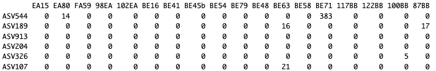

# Demonstration 10
Complete the following demonstration in RStudio. You can follow detail instructions in Xia et al. (2018), Chapter 11: Modeling Over-Dispersed Microbiome Data. Most sections below match the sections in the book

# Modeling Over-Dispersed Microbiome Data
## 11.5. The DESeq2 Package
DESeq is a variance stabilization technique based on a NB model that was recommended and adapted for microbiome count data (McMurdie and Holmes 2014) - https://journals.plos.org/ploscompbiol/article?id=10.1371/journal.pcbi.1003531. 

### 11.5.2 Step-by-Step Implementing DESeq2
```r
install.packages("GUniFrac")
library(GUniFrac)
data(throat.otu.tab)
head(throat.otu.tab) 
otu_tab<-throat.otu.tab
head(otu_tab)

# prepare dataset
countData<-as(otu_tab, "matrix")
head(countData)

#DESeq2 needs taxa(genes=rows) by samples(=columns)format
countData<-(t(countData))
head(countData)

# Create the Sample Metadata Table
data(throat.meta)
head(throat.meta)

group<-throat.meta$SmokingStatus
head(group)

metaData<-data.frame(row.names=colnames(countData),group=group)
head(metaData)

# create DESeq2 object
library("DESeq2")
dds <- DESeqDataSetFromMatrix(countData = countData,
                              colData = metaData,
                              design = ~ group)
# filter data
dds <- dds[rowSums(counts(dds)) > 0,]
dds

# Normalize the Count Data 
dds <- estimateSizeFactors(dds) 
sizeFactors(dds)

# Estimate the Dispersion
dds<- estimateDispersions(dds)

# Test the Differential Abundance
dds$group <- relevel(dds$group, "NonSmoker")

#or by

dds$group <- factor(dds$group, levels = c("NonSmoker", "Smoker"))

dds <- DESeq(dds)

# Extract the Results Table
res <- results(dds)
res

mcols(res, use.names=TRUE)
mcols(dds,use.names=TRUE)[1:4,1:4]

substr(names(mcols(dds)),1,10)
head(assays(dds)[["mu"]])
head(dispersions(dds))
head(mcols(dds)$dispersion)

sizeFactors(dds)
head(coef(dds))

# Compare Differential Abundance Between Groups Using Contrast
res <- results(dds, contrast = c("group", "Smoker", "NonSmoker") )
res

# Adjust p-Values Using FDR
sum(res$pvalue < 0.01, na.rm=TRUE )
table(is.na(res$pvalue))

table(res[,"padj"] < 0.1)  
sum(res$padj < 0.1, na.rm=TRUE )

res_Sig <- res[which(res$padj < 0.1 ),]
head(res_Sig[order(res_Sig$log2FoldChange),])
```

```r
tail(res_Sig[order( res_Sig$log2FoldChange ),])
```
### Diagnose and Improve the Testing Results
Data visualization and clustering can diagnose and help interpreting the results of differential abundance analysis. Here, we introduce several different plots that are associated with diagnostics, clustering, interpretation of differential abundance analysis.
```r
##Diagnostic Plots Using plotMA
plotMA(res)
```

```r
## Diagnostic Plots Using plotDispEsts
plotDispEsts(dds, ylim = c(1e-2, 1e3))
```

```r
## create a volcano plot of fold changes
with(res, plot(log2FoldChange, -log2(pvalue), pch=20, main="Volcano plot", xlim=c(-4,4))) +
with(subset(res, padj<.1 ), points(log2FoldChange, -log2(pvalue), pch=20, col="blue")) +
with(subset(res, padj<.1 & abs(log2FoldChange)>2), points(log2FoldChange, -log2(pvalue), pch=20, col="red"))
```

```r
## transform counts
# To make certain plots we have to transform the raw counts of reads to approximately homoskedastic data. The transformation can be done either by the rlog() or varianceStabilizingTransformation(). The latter is recommended by the DESeq2.

rld <- rlog(dds)
vst <-varianceStabilizingTransformation(dds)
```

```r
## create Heatmap
par(mfrow = c(1, 3))
plot(log2( 1+counts(dds, normalized=TRUE)[,1:2] ), main="Ordinary log2",col="#00000020", pch=20, cex=0.3 )
plot(assay(rld)[,1:2], main="Regularized-logarithm", col="#00000020", pch=20, cex=0.3 )
plot(assay(vst)[,1:2], main="Variance stabilizing",col="#00000020", pch=20, cex=0.3 )
```

```r
head(assay(rld))[,1-3]

par(mfrow = c(1, 1))

install.packages("gplots")
library("gplots" )
library("RColorBrewer" )
library("genefilter" )
library(SummarizedExperiment)
topVarGenes <- head( order( rowVars( assay(rld) ), decreasing=TRUE ), 10 )
heatmap.2(assay(rld)[ topVarGenes, ], scale="row",
          trace="none", dendrogram="column",
          col = colorRampPalette( rev(brewer.pal(9, "RdBu")) )(255))
```

```r

##Histogram of p-Values
hist(res$pvalue, breaks=20, col="grey",
     main = "Smoker vs. NonSmoker", xlab = "p-values")
```


### Independent Filtering
DESeq2 automatically performs independent ltering to filter out weakly differential OTUs. Although these weak OTUs are tested as non-signicant; however, they affect the multiple testing procedure. Thus, it is better to remove them for the analysis. Let's do it
```r
metadata(res)

metadata(res)$alpha
metadata(res)$filterThreshold

plot(metadata(res)$filterNumRej,
     type="b", ylab="number of rejections",
     xlab="quantiles of filter")
lines(metadata(res)$lo.fit, col="red")
abline(v=metadata(res)$filterTheta)
```

The figure plots the number of rejections (adjusted p-value less than a significance level) against the quantiles of a filter statistic (the mean of normalized counts). The number of rejections is maximized by the function results(). The vertical line presents the threshold chosen
```r
##Re-estimate the p-Values
res   

# remove filtered out OTUs by independent filtering 
# they have NA adj. pvals
res <- res[ !is.na(res$padj),]
# with NA pvals (outliers)
res <- res[ !is.na(res$pvalue),]

res <- res[, -which(names(res) == "padj")]

install.packages("fdrtool")
library(fdrtool)
res_fdr <- fdrtool(res$stat, statistic= "normal", plot = T)

head(res_fdr)

res_fdr$param[1, "sd"]
sd

res[,"padj"] <- p.adjust(res_fdr$pval, method = "BH")

hist(res_fdr$pval, col = "gray",
     main = "Smoker vs. NonSkoer, correct null model", xlab = "Corrected p-values")
```

Plot of false discovery rate 

```r
# Extract Differentially Abundant OTUs and Export Results Table
table(res[,"padj"] < 0.1)

res[1:2,]
```
## Using Negative Binomial distribution on phyloseq object to normalize counts and correct over-dispersion
```r
ps<-readRDS(file="Demo10.RDS")
ps
sample_variables(ps)
head(otu_table(ps))
```

```r
# create DESeQ object
diagdds = phyloseq_to_deseq2(ps, ~region_c) 
# Any variable of the metadata would work to create the DESeQ object

# Calculate geometric means
gm_mean = function(x, na.rm=TRUE){
  exp(sum(log(x[x > 0]), na.rm=na.rm) / length(x))
}
geoMeans = apply(counts(diagdds), 1, gm_mean)

# Estimate size factors
diagdds = estimateSizeFactors(diagdds, geoMeans = geoMeans)

# Get Normalized read counts
normcounts <- counts(diagdds, normalized = TRUE)

# Round read counts
round(normcounts, digits = 0) -> normcountsrd

# Transform matrix of normalized counts to phyloseq object
otu_table(normcountsrd, taxa_are_rows = TRUE) -> ncr

# Replace otu_table in original phyloseq object
otu_table(ps) <- ncr
head(otu_table(ps))
```


Now you can apply all the statistical analyses we have revised in previous chapters

## DESeq analysis of differentially abundant taxa across factors using ps object
```r
ps<-readRDS(file="Demo10.RDS")

# create DESeQ object
diagdds = phyloseq_to_deseq2(ps, ~wash) # less significant results

dds = DESeq(diagdds, test="Wald", fitType="local")
# This function is the same as 'diagdds = estimateSizeFactors(diagdds)' above

res = results(dds, cooksCutoff = FALSE) 
# alpha=0.1 is the default, reduce for more restringing results
res
head(res,10)
summary(res)
# Count the number of taxa DE with a padj under 0.1
sum(res$padj < 0.01, na.rm=TRUE) 

# order our results table by the smallest p value
resOrdered <- res[order(res$padj),] 

head(resOrdered, 10)
resSig <- subset(res, padj < 0.01)
# significant taxa with the strongest down-regulation
head(resSig[ order( resSig$log2FoldChange ), ])

# significant taxa with the strongest up-regulation
head(resSig[ order( resSig$log2FoldChange, decreasing=TRUE ), ]) 
```


