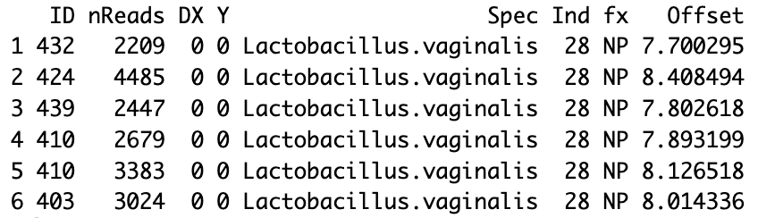

# Demonstration 11
Complete the following demonstration in RStudio. You can follow detail instructions in Xia et al. (2018), Chapter 12: Modeling Zero-Inflated Microbiome Data. All sections below match the sections in the book

# Modeling Zero-Inflated Microbiome Data 

## 12.2. Zero-inflated Models: ZIP and ZINB 
Microbiome data is usually sparse with many zeros. To model such excess of zeros we can use zero-inflated regression models (e.g., ZIP or ZINB) 
ZIP or ZINB regression employs a mixture of a logistic regression for modeling structural zeros, and a log-linear regression for modeling the remaining count data.
A ZIP model (Zero-Inflated Poisson) is used for count data with excess zeros, while a ZINB model (Zero-Inflated Negative Binomial) is also used for excess zeros but additionally accounts for overdispersion in the data, meaning the variance is larger than the mean, making it more flexible for complex count data sets where both zero inflation and overdispersion might occur; essentially, ZINB is a more robust option when dealing with overdispersed count data with excess zeros
ZIP uses the Poisson distribution, which assumes the variance is equal to the mean, while ZINB (Zero-Inflated Negative Binomial) uses the Negative Binomial distribution, which allows for overdispersion
```r
# Step-by-Step Implementing ZIP and ZINB using the Vaginal Microbiota Data
abund_table=read.csv("allTD_long.csv",header=TRUE)
head(abund_table)
tail(abund_table)

library(dplyr)
abund_table_28 <- filter(abund_table, Ind == 28)
head(abund_table_28)

# The following R codes create the group variable“x”, and define it as a factor
abund_table_28$x<- with(abund_table_28,ifelse(as.factor(DX)%in% "0",0, 1))
names(abund_table_28)

abund_table_28$fx <- factor(abund_table_28$x)
names(abund_table_28)
head(abund_table_28)
View(abund_table_28)

# Removing missing values is not really necessary, but it makes model validation easier
I=is.na(abund_table_28$Y) | is.na(abund_table_28$fx)|is.na(abund_table_28$nReads)
abund_table_28a <- abund_table_28[!I,]

# Check Outcome Distribution and Zeros
par(mfrow=c(1,2))
plot(table(abund_table_28a$Y),ylab="Frequencies",main="Lactobacillus.vaginalis",
     xlab="Observed read values")
plot(sort(abund_table_28a$Y),ylab="Frequencies",main="Lactobacillus.vaginalis",
     xlab="Observed read values")
par(mfrow=c(1,1))
```


Offsets:
In linear regression, an "offset" refers to a known variable that is added directly to the linear predictor, with a fixed coefficient of 1, meaning it is not estimated by the model but is included to adjust for a pre-determined factor that influences the response variable; essentially, it shifts the entire regression line up or down without affecting the slope of the line itself. 
The total count read is used to create the offset. The offset will be adjusted as a covariate in the model later to ensure microbiome response is relative abundance instead of count data
```r
# Create the Offset
abund_table_28a$Offset <- log(abund_table_28a$nReads);
head(abund_table_28a$Offset)
head(abund_table_28a)
```


ID represents the identifier of a given subject
nReads is the total number of reads in the sample
DX is the group indicator (0 = non-pregnant; 1 = pregnant)
Y is the number of sequences (count) for each ASV
Spec gives the species
Ind is a numeric indicator for the ASV (1,…, 28)
x = fx = DX
```r
# Create a Formula for Fitting ZIP and ZINB
# The formula is used to specify both components of the model: counts and zeros
# The two components are separated by | as: count covariables | zero covariables and they can be different in each component
f <- formula(Y ~  fx | fx)
# if eequal you can also use:
f <- formula(Y ~  fx)

# Offsets can be specified in both parts of the model pertaining to count and structural zero models:
f <- formula(Y ~  fx + offset(Offset)|fx)
f <- formula(Y ~  fx + offset(Offset)|fx + offset(Offset))

f28 <- formula(Y ~  fx + offset(Offset)|fx)

# Fit ZIP and ZINB
install.packages("pscl")
library(pscl)

ZIP28 <- zeroinfl(formula = f28, dist = "poisson", link = "logit", data = abund_table_28a)
# dist = "poisson": specifies poisson distribution for count data
# link= logit: specifies the logistic link for the zeros
summary(ZIP28)

ZINB28 <- zeroinfl(formula = f28, dist = "negbin", link = "logit", data = abund_table_28a)
# dist = "poisson": specifies NB distribution for count data
# link= logit: specifies the logistic link for the zeros
summary(ZINB28)
```
## 12.3 Zero-Hurdle Models: ZHP and ZHNB 
A hurdle model is a two-part model that separates zero counts from positive counts by assuming that a threshold, or "hurdle", must be overcome for positive counts to occur
The zero-hurdle models can be expressed as the zero-hurdle Poisson (ZHP) model and zero-hurdle negative Binomial (ZHNB) model
```r
# 12.3.3 Modeling ZHP and ZHNB
ZHP28 <- hurdle(formula = f28, dist= "poisson", data = abund_table_28a)
summary(ZHP28)

ZHNB28 <- hurdle(formula = f28, dist= "negbin", data = abund_table_28a)
summary(ZHNB28)

# both models show that the group variable (fx1) is significant 
# The theta value in the output indicates that the data are overdispersed.
```
## 12.3.4 Comparing Zero-inflated and Zero-Hurdle Models
```r
##12.3.4.1 Using Likelihood Ratio Test to compare nested models
install.packages("lmtest")
library(lmtest)

lrtest(ZIP28,ZINB28)
lrtest(ZHP28,ZHNB28)
# The testing results show that the ZIP model is not appropriate. ZINB model should be chosen.

## 12.3.4.2 Using AIC to compare non-nested models
#lower is better
t(AIC(ZIP28, ZINB28, ZHP28, ZHNB28))

# ZINB and ZHNB fit the data best
```


