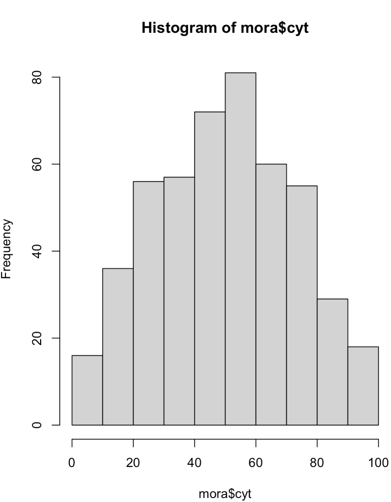
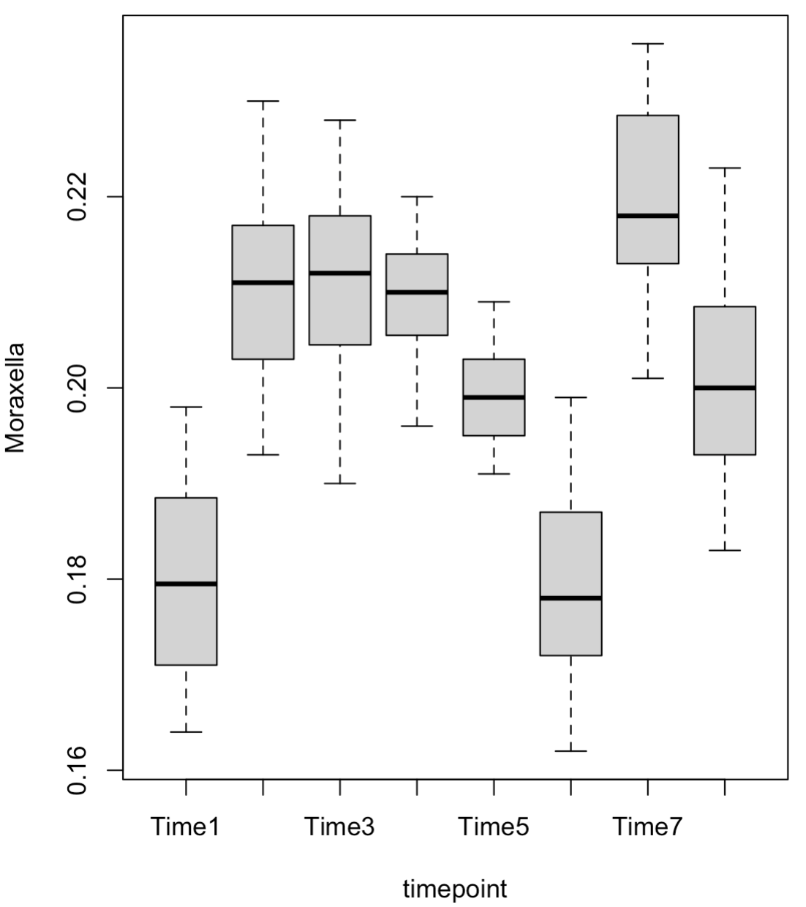
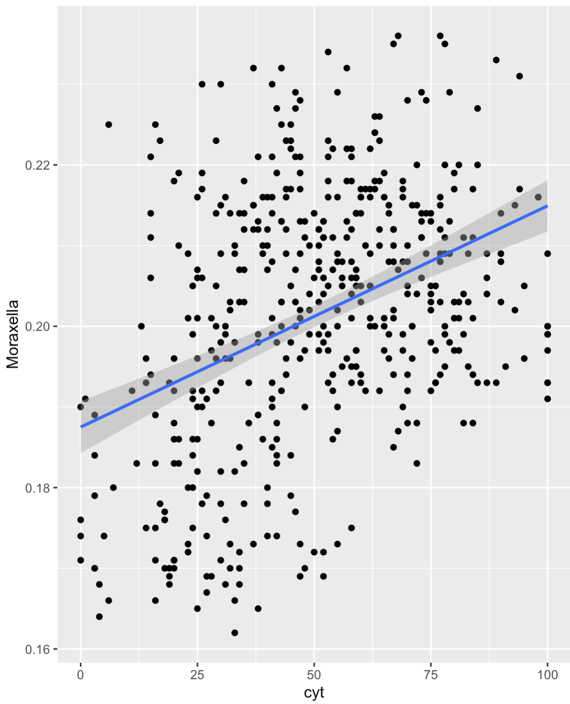

# LM, LMM, GLM, GLMM and Bayesian modeling of longitudinal data in R

Let's say we want to understand how Moraxella relative abundance (predictor) impacts health status (response) and cyt abundance (response) while accounting for variation across time points (timepoints) and patient repeated measures (patient)
You can’t linear model multiple dependent variables of different types (factor + numeric) simultaneously in a standard lmer() or glmer() setup. To do that, however, you can use Bayesian modeling. 
Additionally you cannot use LM or LMM when your response variable is a factor, but you can use GLM or GLMM. Let's see how

```r
# load the data and have a look at it
mora <- read.csv("demo12s.csv", header=TRUE, row.names = 1)
head(mora)
dim(mora)

# Have a look at the data distribution of the numerical responses
hist(mora$cyt)
# it’s roughly bell-shaped (normal), so you can use linear models
```

```r
# Have a look at the predictors using a box plot
boxplot(Moraxella ~ timepoint, data = mora)
```

```r
# Let's also plot the data with ggplot2
library(ggplot2)
ggplot(mora, aes(x = cyt, y = Moraxella)) +
  geom_point()+
  geom_smooth(method = "lm")


```
## Analysis using LM
```r
library(lme4)
m1.lm <- lm(cyt~Moraxella + timepoint, data = mora)
anova(m1.lm)

# Response: cyt
# Df Sum Sq Mean Sq F value    Pr(>F)    
# Moraxella   1  38538   38538 172.186 < 2.2e-16 ***
# timepoint   7 109830   15690  70.103 < 2.2e-16 ***
# Residuals 471 105417     224  

# Sum Sq: Total variation explained
# Moraxella explains 38,538 units of variation in cyt
# timepoint explains 109,830
# Residuals account for 105,417 (unexplained noise)
# F value: Measures the ratio of explained variance to unexplained variance
# Pr(>F):P-value for the F test
# Conclusion: Both predictors have very strong effects on cyt (p < 2e-16)
```
## Analysis using LMM
```r
library(lme4)
m1.lmer <- lmer(cyt~Moraxella + timepoint + (1|patient), data = mora)
anova(m1.lmer)

#           Sum Sq Mean Sq NumDF DenDF F value Pr(>F)    
# Moraxella      4     3.9     1   471  0.0175 0.8949    
# timepoint 109830 15690.0     7   471 70.1029 <2e-16 ***
# timepoint strongly influences cytokine levels.
# Moraxella has no apparent effect on cytokines

# The lm() model assumes all observations are independent, which they are not in your data (due to repeated measures per patient). 
# So lm() underestimates standard errors → false positives.
# lmer() accounts for repeated measures (within-patient correlation). It allows each patient to have their own baseline cytokine level (random intercept).
# This absorbs a portion of the variance in cyt that would otherwise be attributed to Moraxella or other fixed effects.
# lmer() also correctly reduces the effective sample size, leading to less power and wider confidence intervals.
# Hence we should use LMM
```
### Compare LME models using different predictors
```r
# You should use maximum likelihood when comparing models with different fixed effects, so REML = FALSE
m1.lmer <- lmer(cyt~1 + (1|patient), data = mora, REML = FALSE)
m2.lmer <- lmer(cyt~Moraxella + (1|patient), data = mora, REML = FALSE)
m3.lmer <- lmer(cyt~Moraxella + timepoint + (1|patient), data = mora, REML = FALSE)
anova(m1.lmer, m2.lmer, m3.lmer)
```
## Analysis using GLM
```r
library(lme4)
m1.glm <- glm(status ~ Moraxella + timepoint, data = mora, family = binomial) 
anova(m1.glm)

# Df Deviance Resid. Df Resid. Dev  Pr(>Chi)    
# NULL                        479     665.12              
# Moraxella  1    8.132       478     656.99  0.004349 ** 
# timepoint  7   47.608       471     609.38 4.248e-08 ***

# NULL row: This is the intercept-only model (model without predictors). It serves as a baseline for evaluating whether adding predictors significantly improves the model. It has a total deviance = 665.12.
# Moraxella: Adding Moraxella to the model reduces the deviance by 8.13 points, which is statistically significant: p-value = 0.0043
# Interpretation: Moraxella abundance significantly improves prediction of status (e.g., sick vs. healthy), controlling for nothing else yet.
# timepoint: Adding timepoint (after Moraxella) reduces deviance by 47.61 points — highly significant: p-value < 0.0000001
# Interpretation: Timepoint is a very strong predictor of status, over and above Moraxella.
```
## Analysis using GLMM
```r
library(lme4)
m2.glmer <- glmer(status ~ Moraxella + timepoint + (1|patient), data = mora, family = binomial) 
summary(m2.glmer)

m1.glmer <- glmer(status ~ Moraxella + (1|patient), data = mora, family = binomial) 
summary(m1.glmer)

# Scaled residuals: 
#   Min      1Q  Median      3Q     Max 
# -2.9671 -0.0850  0.0008  0.0021  3.3501
# These help assess model fit. Your residuals are mostly centered near 0, but you have some large residuals (Max ≈ 3.35), suggesting a few outliers or mismatches between prediction and observed outcome.

# Random effects:
# Groups  Name        Variance Std.Dev.
# patient (Intercept) 397.7    19.94   
# Number of obs: 480, groups:  patient, 20
# There is substantial variability between patients. Std.Dev of 19.94 (on the logit scale) suggests wide differences in baseline probability of being sick per patient.

# Fixed effects:
# Estimate Std. Error z value Pr(>|z|)    
# (Intercept)   -7.359      4.896  -1.503 0.132801    
# Moraxella     97.726     26.763   3.651 0.000261 ***
# Since the coefficient for Moraxella is large and positive, this suggests a strong, statistically significant positive association: higher Moraxella → higher chance of status 1 (i.e., [0]"disease" [1]"healthy").
```
### compare GLMM models
```r
anova(m1.glmer, m2.glmer)
AIC(m1.glm, m1.glmer, m2.glmer) # not nested models
BIC(m1.glm, m1.glmer, m2.glmer) # not nested models
```
## Analysis using Bayesian Joint Model
Model both cyt and health status simultaneously with shared predictors/random effects using Bayesian Joint Model
```r
install.packages("brms")
library(brms)
joint_model <- brm(mvbind(status, cyt) ~ Moraxella + timepoint + (1 | patient),
  data = mora,
  family = list(bernoulli(), gaussian()))  # for binary status and continuous cytokine

# A Bernoulli GLMM for status (binary outcome: e.g., healthy vs sick)
# A Gaussian LMM for cyt (cytokine abundance, continuous)
# Both models share fixed effects: Moraxella, timepoint, and random intercepts for patient
summary(joint_model)

# sd(status_Intercept) = 19.03
# sd(cyt_Intercept) = 1.16
# This suggests substantial inter-patient variation in baseline status (which is logistic, so it's on the log-odds scale).
# Less variation in cyt (continuous)
# Estimate:	Posterior mean (Bayesian equivalent of coefficient)
# Rhat:	Convergence diagnostic — should be ~1.00
# status_Moraxella = 299.12 (CI: 122.25 – 539.60). Strong positive association between Moraxella abundance and the probability of status = 1 (i.e., [0]"disease" [1]"healthy").
# CI excludes 0 → statistically credible effect
# cyt_Moraxella = -8.66 (CI: -176.71 to 156.31)
# Wide credible interval including 0 → uncertain effect of Moraxella on cytokine level.
# Low certainty, possibly no effect.
# status_timepointTimeX & cyt_timepointTimeX
# Timepoint has strong associations with both outcomes.
# All status_timepoint terms have negative coefficients → decreasing probability of illness over time?
# cyt_timepoint terms show clear positive/variable effects → cytokines fluctuate significantly with time.

hypothesis(joint_model, "status_Moraxella = 0")
hypothesis(joint_model, "cyt_Moraxella = 0")
hypothesis(joint_model, "status_timepointTime2 = 0")
```
### Plot results
```r
conditional_effects(joint_model)

# plot 1: status	Moraxella	Shows how the probability of being sick changes with Moraxella abundance. Y-axis is on probability scale (logit-transformed).
# plot 2: cyt	Moraxella	Shows how cytokine abundance changes with Moraxella abundance. Y-axis is on raw scale (Gaussian).
# plot 3: status	timepoint	Estimated probability of being sick at each timepoint. Each dot = marginal estimate; error bars = credible intervals.
# plot 4: cyt	timepoint	Same, but showing cytokine levels across timepoints.
```
