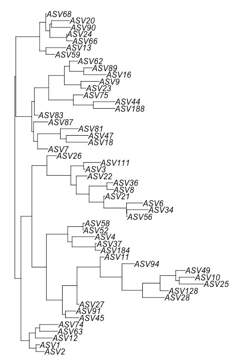
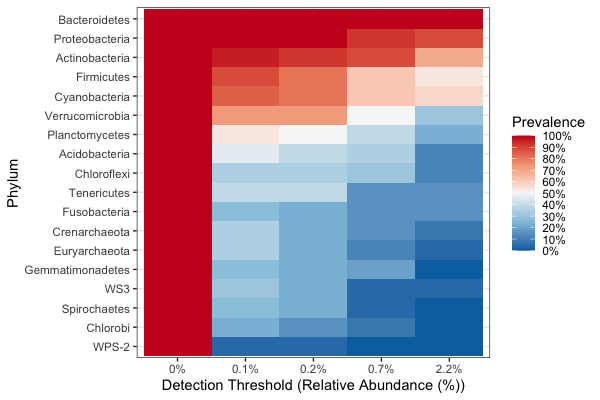

# Demonstration 3
Complete the following demonstration in RStudio. Xia et al. (2018), Chapter 7: Exploratory Analysis of Microbiome Data and Beyond provides some directions, but more information can be found at the https://bioconductor.org/packages/release/bioc/html/phyloseq.html. Review them to interpret scripts and outcomes of your analyses

# Introduction to phyloseq and microbiome packages

## Phyloseq package
phyloseq provides a set of classes and tools to facilitate the import, storage, analysis, and graphical display of microbiome census data

```r
# First, we install phyloseq via BiocManager

# install BiocManager
if (!requireNamespace("BiocManager", quietly = TRUE))
  install.packages("BiocManager")

# install phyloseq
BiocManager::install("phyloseq")

# phyloseq version
packageVersion("phyloseq")
library(phyloseq)

# Set the R working directory to the folder where you stored the datasets and load them
setwd("your directory")

# Our phyloseq object contains three data frames: ASV abundances, taxonomic information and metadata
tax_tab <- read.delim("new_tax_tab.txt")
otu_tab <- read.delim("new_otu_tab.txt", row.names = 1)
meta_tab <- read.csv("new_meta_tab.csv", header=TRUE, row.names = 1)

# Check and make sure that the datasets have been correctly loaded
head(otu_tab,3) # are taxa as rows or not? see below
head(tax_tab)
head(meta_tab,3)

# Check and make sure that the classes of datasets are all data.frame
class(otu_tab)
class(tax_tab)
class(meta_tab)

# Since the above codes show that both otu_table and tax_table components are data frames, we need to convert them into matrices
otumat<-as.matrix(otu_tab)
taxmat<-as.matrix(tax_tab)

class(otumat)
class(taxmat)

# Create a phyloseq object using phyloseq () and calling the three elements (otu_table, tax_table and sample_data)
otu<-otu_table(otumat,taxa_are_rows = TRUE)
tax<-tax_table(taxmat)
sam<-sample_data(meta_tab)
physeq <- phyloseq(otu, tax, sam)
physeq

# Add a random phylogenetic tree component
library("ape")
random_tree = ape::rtree(ntaxa(physeq), rooted=TRUE, tip.label=taxa_names(physeq))
plot(random_tree)
```

```r
# Now merge the tree data to the phyloseq object we already have by using the merge_phyloseq()
ps = merge_phyloseq(physeq, random_tree)
ps

# create phyloseq object in one step
ps <- phyloseq(tax_table(as.matrix(tax_tab)), phy_tree(random_tree), sample_data(meta_tab), otu_table(otu_tab, taxa_are_rows = TRUE))
ps

# phyloseq object information
str(ps)
nsamples(ps)
sample_names(ps)
min(colSums(otu_table(ps)))
sample_sums(ps)
sample_variables(ps)
phy_tree(ps)
taxa_names(ps)[1:10]
head(sample_data(ps))
head(otu_table(ps))
head(tax_table(ps))
rank_names(ps)
get_taxa_unique(ps, "Genus")

# separate phylum Proteobacteria
ps_prot <- subset_taxa(ps, Phylum=="Proteobacteria")
ps_prot

# separate male samples (see gender)
ps_male <- subset_samples(ps, gender == "M")
ps_male

# agglomerate taxa by genus
ps_gen <- tax_glom(ps, taxrank = "Genus")
ps_gen

# prune taxa with <50000 reads
ps1 <- prune_taxa(taxa_sums(ps) > 50000, ps)
ps1

# prune samples with <10000 reads
ps2 = prune_samples(sample_sums(ps) >= 10000, ps)
ps2

# transform otu counts to otu proportions
head(otu_table(ps))
ps_prop <- transform_sample_counts(ps, function (x) x/sum(x))
head(otu_table(ps_prop))

# Export phyloseq data into CSV Files

#Export taxonomy
taxonomy<-tax_table(ps)
write.csv(taxonomy,file="tax.csv")

#Export table of OTUs
table_otu<-otu_table(ps)
write.csv(table_otu,file="otu.csv")

# Export table of OTUs with taxonomy
table_all<-cbind(tax_table(ps),otu_table(ps))
write.csv(table_all,file="otu_tax.csv")
```

## Microbiome package
The microbiome package is built on the phyloseq objects and extends some functions of the phyloseq package in order to facilitate manipulation and processing
microbiome datasets

```r
# Install microbiome R package
remotes::install_github("microbiome/microbiome")
library(microbiome)

# Install also R package knitr: a powerful tool used for dynamic report generation
install.packages("knitr")
library(knitr)

# Use the GlobalPatterns datasets included in the phyloseq package to illustrate how to use the microbiome
# GlobalPatterns is a phyloseq object
data(GlobalPatterns)
GlobalPatterns

# Rename GlobalPatterns data 
physeq <- GlobalPatterns
physeq

# Summarize the Contents of phyloseq Object
summarize_phyloseq(physeq)

# display absolute abundances for 5 rows
head(otu_abs <- abundances(physeq),5)

# Estimate and display relative abundances
head(otu_rel <- abundances(physeq, "compositional"),5)

# retrieve the total read counts
read_tot <- readcount(physeq)
head(read_tot)

# retrieve the taxonomy table
tax <- tax_table(physeq)
head((tax),3)

# retrieve metadata table
meta <- meta(physeq)
head((meta),3)

# convert the phyloseq data to a data frame for easier plotting and downstream statistical analysis using function melt
df <- psmelt(physeq)

library(knitr)
kable(head(df,4))

# Number of taxa
ntaxa(physeq)

# Most abundant taxa
top_taxa(physeq, n = 10)

# Data Transformations
# Transform absolute abundances to relative abundances
head(otu_table(physeq),3)
physeq_comp <- microbiome::transform(physeq, "compositional")
head(otu_table(physeq_comp),3)

# The Hellinger transformation, which is square root of the relative abundance given at the scale [0,1].
physeq_hellinger <- microbiome::transform(physeq_comp, "hellinger")
head(otu_table(physeq_hellinger),3)

# log10 transformation
physeq_log10 <- microbiome::transform(physeq, "log10")
head(otu_table(physeq_log10),3)

# the central log-ratio (CLR) transformation
physeq_clr <- microbiome::transform(physeq, "clr")
head(otu_table(physeq_clr),3)

# Export phyloseq Data into CSV Files

# check files in phyloseq object
slotNames(physeq)

# convert files to data frames
otu_df = as.data.frame(physeq@otu_table)
tax_df = as.data.frame(physeq@tax_table)
sam_df = as.data.frame(physeq@sam_data)

# export otu_table, tax_table, and sam_data using the readr package
library(readr)

write_csv(otu_df, le = "otu_tab_GlobalPatterns.csv")
write_csv(tax_df, le = "tax_tab_GlobalPatterns.csv")
write_csv(sam_df, le = "sam_tab_GlobalPatterns.csv")

# core microbiome analysis per phylum

pseq.rel <- microbiome::transform(physeq, "compositional")
pseq.rel.gen <- aggregate_taxa(pseq.rel, "Phylum")

library(RColorBrewer)
prevalences <- seq(.05, 1, .05)
detections <- round(10^seq(log10(1e-5), log10(.2), length = 10), 3)
p1 <- plot_core(pseq.rel.gen, 
                plot.type = "heatmap", 
                colours = rev(brewer.pal(5, "RdBu")),
                prevalences = prevalences, 
                detections = detections, min.prevalence = 0.99) +
  xlab("Detection Threshold (Relative Abundance (%))") +  ylab("Phylum")
p1
```

