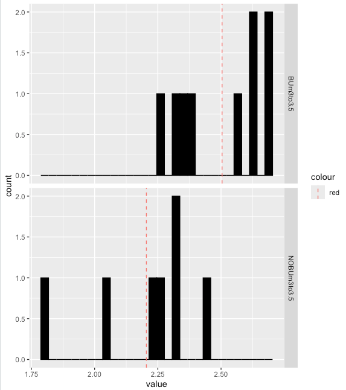
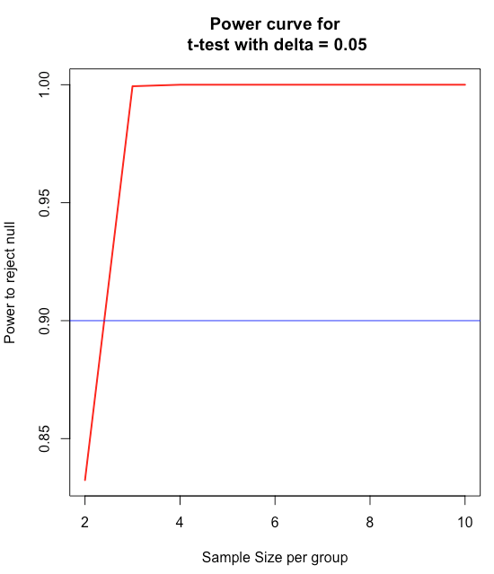

# Demonstration 4
Complete the following demonstration in RStudio. All the sections below match those in Xia et al. (2018), Chapter 5: Power and Sample Size Calculations for Microbiome Data. Review them to interpret scripts and outcomes of your analyses

# Power Analysis for Microbiome Data

## 5.2.2 Diversity Data for ALS Study
```r
# upload the ALS data set including Shannon diversity estimates for 16 samples belonging to two groups
df_H_G93BUm3 <- read.csv("ALS.csv",row.names=1,check.names=FALSE) 
df_H_G93BUm3

library(ggplot2) 
# Create histogram plot of estimates for both groups 
p<-ggplot(df_H_G93BUm3, aes(x=value))+
  geom_histogram(color="black", fill="black")+
  facet_grid(Group ~ .)
p
#Calculate the mean of each group
#Calculate the average Shannon diversity of each group using the package plyr
library(plyr)
mu <- ddply(df_H_G93BUm3, "Group", summarise, grp.mean=mean(value))
head(mu)

#add mean lines
p+geom_vline(data=mu, aes(xintercept=grp.mean, color="red"),
             linetype="dashed")

```

## 5.2.3 Calculating Power or Sample Size Using R Function power.t.test
Here, we focus on illustrating how to calculate the power or sample size using R software. In R, the function power.t.test() in basic R and the function pwr.t.test() in the pwr package can be used to conduct power analysis. We use the power.t.test. The usage of this function is shown below:
power.t.test (n = sample size, delta = effect size, sd = standard deviation, sig. level = 0.05, power = NULL, type = c(“two.sample”, “one.sample”, “paired”), alternative = (“two.sided”, “one.sided”))
where, n is the number of sample size per group, delta is true difference in means, sd is the standard deviation, sig.level is the significance level (Type I error probability), power is the power of test (1 minus Type II error probability), type is the type of t test, and alternative is one-or-two sided test.
Since the standard deviation of the mean difference is unknown, it needs to be estimated using formula in this chapter (5.5).

```r
# calculate mean and variance
mu <- ddply(df_H_G93BUm3, "Group", summarise, grp.mean=mean(value));mu

#         Group grp.mean
#1    BUm3to3.5    2.504
#2  NOBUm3to3.5    2.205

var <- ddply(df_H_G93BUm3, "Group", summarise, grp.var=var(value));var

#        Group   value
#1   BUm3to3.5 0.02892
#2 NOBUm3to3.5 0.04349

n1 <- 9
n2 <-7
s1<-sqrt(0.02892)
s1
#[1] 0.1701
s2<-sqrt(0.04349)
s2
#[1] 0.2085
sd=sqrt((n1-1)*s1^2+(n2-1)*s2^2)/(n1+n2-2)
sd
#[1] 0.05012

power.t.test(n=2:10,delta=2.504-2.205,sd=0.05012)

# From output create the vectors below
n = c(2, 3, 4, 5, 6, 7, 8, 9, 10)  
power = c(0.8324, 0.9994, 1.0000, 1.0000, 1.0000, 1.0000, 1.0000, 1.0000, 1.0000)

df_P <-data.frame(n,power)
df_P

   n power
1  2 0.8324
2  3 0.9994
3  4 1.0000
4  5 1.0000
5  6 1.0000
6  7 1.0000
7  8 1.0000
8  9 1.0000
9 10 1.0000
```
From above power analysis, we can see that a size sample of 2 G93A mice per group, randomly assigned to butyrate treatment or no treatment control, will provide 83% power to reject the null hypothesis of no difference in the Shannon diversity in the two groups. If the sample size increases to 3 per group, the power will increase to more than 99%. 
```r
# We can generate power and sample size graphs to visualize the power and sample size we need to reject the null hypothesis using following R codes

n = c(2, 3, 4, 5, 6, 7, 8, 9, 10)  
power = c(0.8324, 0.9994, 1.0000, 1.0000, 1.0000, 1.0000, 1.0000, 1.0000, 1.0000)

power <- sapply(n, function (x) power.t.test(n=x, delta=2.504-2.205,sd=0.05012)$power)
plot(n, power, xlab  = "Sample Size per group", ylab  = "Power to reject null",
     main="Power curve for\n t-test with delta = 0.05",
     lwd=2, col="red", type="l")

abline(h = 0.90, col="blue")

```

## 5.3 Power Analysis for Comparing Diversity Across More than Two Groups Using ANOVA	

### 5.3.2 Calculating Power or Sample Size Using R Function pwr.avova.test	
```r
ALSsel <- read.csv("ALSsel.csv",row.names=1,check.names=FALSE) 

# First, we get F statistic by fitting linear model.
fit = lm(formula = value~Group,data=ALSsel)
anova (fit)

# Then, we call the pwr.anova.test() function from pwr package to calculate powers
install.packages("pwr")
library(pwr)
pwr.anova.test(f= 0.23,k=4,n=45:55,sig.level=0.05)

n=c(n = 45, 46, 47, 48, 49, 50, 51, 52, 53, 54, 55)
power = c(0.7276151, 0.7382780, 0.7486181, 0.7586391, 0.7683450, 0.7777403, 0.7868298, 0.7956185, 0.8041118, 0.8123153, 0.8202347)

df_P <-data.frame(n,power)
df_P

# The results above show that 53 samples are needed for each group to obtain 80% power based on the effect sizes detected in this pilot study using ANOVA test.
```
## 5.4 Power Analysis for Comparing a Taxon of Interest Across Groups 

### 5.4.2 Power Analysis Using R Function power.prop.test 
```r
Butyrivibrio=read.csv("Butyrivibrio.csv",row.names=1,check.names=FALSE)
Butyrivibrio

# creare 2 x 2 contingency table using the MASS package 
library(MASS)
tbl = table(Butyrivibrio$Group, Butyrivibrio$Present) 
tbl

#          Absent Present
# Butyrate      0       9
# Control       3       4

# The above table shows the distribution of the proportion: 4 (57%) out of 7 control samples had Butyrivibrio brisolvens, while 9 (100%) out of 9 Butyrate treatment samples did

# The following plain R codes are used to implement the sample size and power calculations using formulas in (5.16) and (5.17)

p1=1.0
p2=0.57
r=1
alpha=0.05
beta=0.20
(n2=(p1*(1-p1)/r+p2*(1-p2))*((qnorm(1-alpha/2)+qnorm(1-beta))/(p1-p2))^2)
ceiling(n2)
z=(p1-p2)/sqrt(p1*(1-p1)/n2/r+p2*(1-p2)/n2)
(Power=pnorm(z-qnorm(1-alpha/2))+pnorm(-z-qnorm(1-alpha/2)))

# However, the convenient way is to use following R function power.prop.test.
# You can specify multiple samples to test the powers

power.prop.test(n=10:20,  p1=1,  p2=.57,  sig.level=0.05, power=NULL,  alternative=c("one.sided"), strict  = FALSE)

# The results show that 11 samples in each group can obtain 83% power to detect the effect sizes based on our pilot study.
```

## 5.5 Comparing the Frequency of All Taxa Across Groups Using Dirichlet-Multinomial Model                            
### 5.5.3 Power and Size Calculations Using HMP Package
```r
# 5.5.3.1 Preparing Data Sets for Use of HMP Package

install.packages("HMP",repo="http://cran.r-project.org", dep=TRUE)
library(HMP)

Buty=read.csv("ALSG93A3.5mButyrateGenus.csv",row.names=1,check.names=FALSE)
NOButy=read.csv("ALSG93A3.5mNoButyrateGenus.csv",row.names=1,check.names=FALSE) 

head(Buty)
head(NOButy)

# transpose files
Buty_t <- t(Buty)
NOButy_t<-t(NOButy)

head(Buty_t)
head(NOButy_t)

ncol(Buty_t)  # for the number of taxa
nrow(Buty_t)  # for the number of samples

ncol(NOButy_t)  # for the number of taxa
nrow(NOButy_t)  # for the number of samples

### 5.5.3.2 Power and Size Calculations Using Taxa Composition Data Analysis

# get a list of Dirichlet-multinomial parameters

fit_Buty <- DM.MoM(Buty_t)
fit_Buty 
fit_NOButy <- DM.MoM(NOButy_t)
fit_NOButy

# set up the number of Monte-Carlo experiments
numMC <- 1000

#The first number is the number of reads and the second is the number of subjects
nrsGrp1 <- rep(1000, 10)
nrsGrp2 <- rep(1000, 10) 
group_Nrs <- list(nrsGrp1, nrsGrp2)

# compute size of the test statistics (Type I error)
alphap <- fit_Buty$gamma
pval1 <- MC.Xdc.statistics(group_Nrs, numMC, alphap, "hnull")
pval1

# Compute power of the test statistics (Type II error)
alphap <- rbind(fit_Buty$gamma, fit_NOButy$gamma)
pval2 <- MC.Xdc.statistics(group_Nrs, numMC, alphap)
pval2

### 5.5.3.3 Power and Size Calculations Using Rank Abundance Distributions Data Analysis

#### Several Sample RAD-Probability Mean Test Comparison With Known Reference Vector of Proportions

# order taxa in order of decreasing abundance and collapse less-abundant taxa into“Other” category using the Data. lter() function.
filter_Buty<- Data.filter(Buty_t, "sample", 1000, 10)
head(filter_Buty)

filter_NOButy<- Data.filter(NOButy_t, "sample", 1000, 10)
head(filter_NOButy)

# get a list of Dirichlet-multinomial parameters(i.e., loglik, gamma, pi and theta) for the data using the function DM.MoM().
fit_Buty <- DM.MoM(filter_Buty);fit_NOButy <- DM.MoM(filter_NOButy);

fit_Buty$pi 
fit_NOButy$pi

fit_Buty$theta  
fit_NOButy$theta

#set up the number of Monte-Carlo experiments
numMC <- 1000 

# The first number is the number of reads and the second is the number of subjects
nrsGrp1 <- rep(1000, 10);nrsGrp2 <- rep(1000, 10)
group_Nrs <- list(nrsGrp1, nrsGrp2)

# set up the values of the vector of taxa frequencies (taxa proportion) and overdispersion parameters for each group
pi0 <- fit_Buty$pi
group_theta <- c(0.007523, 0.01615)

# compute size of the test statistics (Type I error)
pval1 <- MC.Xmc.statistics(group_Nrs, numMC, pi0, group.theta=group_theta, type="hnull")
pval1

# compute power of the test statistics (Type II error)
group_pi <- rbind(fit_Buty$pi, fit_NOButy$pi)
pval2 <- MC.Xmc.statistics(group_Nrs, numMC, pi0, group_pi, group_theta)
pval2

#### Several Sample RAD-Probability Mean Test Comparison With Unknown Vector of Proportion

#Generate the number of reads per sample
#The first number is the number of reads and the second is the number of subjects
nrsGrp1 <- rep(1000, 10) ;nrsGrp2 <- rep(1000, 10);
group_Nrs <- list(nrsGrp1, nrsGrp2)

pi0 <- fit_Buty$pi
group_theta <- c(0.007523, 0.01615)

#Computing size of the test statistics (Type I error)
group_theta <- c(fit_Buty$theta, fit_NOButy$theta)
pval1 <- MC.Xmc.statistics(group_Nrs, numMC, pi0, group.theta=group_theta, type="hnull")
pval1

#Computing Power of the test statistics (Type II error)
group_pi <- rbind(fit_Buty$pi, fit_NOButy$pi)
pval2 <- MC.Xmc.statistics(group_Nrs, numMC, pi0, group.pi=group_pi, group.theta=group_theta)
pval2
```

## 5.5.4 Effect Size Calculation Using HMP Package
```r
#Combine the data sets into a single list
group_data <- list(filter_Buty, filter_NOButy)
effect <- Xmcupo.effectsize(group_data)
effect
```
