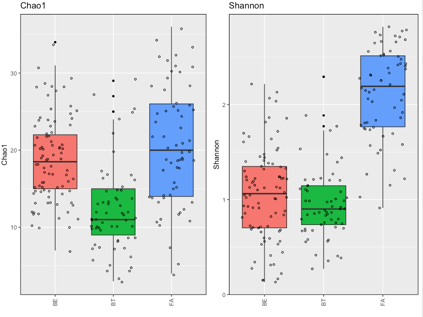

# Demonstration 5                      
Complete the following demonstration in RStudio. You can read about diversity indices in Xia et al. (2018), Chapter 6: Community Diversity Measures and Calculations. Review that to interpret scripts and outcomes of your analyses

# I. Community Diversity Estimates

## Estimate alpha-diversity
```r
# Use different R packages to estimate several alpha-diversity and plot the results
library(microbiome)
library(phyloseq)
library(knitr)

# Use GlobalPatterns data (which is a phyloseq object)
data(GlobalPatterns)
ps1 <- GlobalPatterns
ps1

# Remove taxa represented by <1000 reads to create a smaller dataset
physeq = prune_taxa(taxa_sums(ps1) > 1000, ps1)
physeq

# microbiome: The following R commands calculate Chao 1 richness
chao1 <- alpha(physeq, index = "chao1")
head(chao1,3)

# microbiome: The following R commands calculate Chao 1 richness and the observed taxa
rich <- richness(physeq)
head(rich,3)

# microbiome: The following R commands calculate pielou index
pielou <- alpha(physeq, index = "pielou")
head(pielou,3)

# microbiome: The following R commands calculate all available evenness measures 
even <- evenness(physeq, "all")
head(even,3)

# phyloseq: The following R commands estimate multiple indices
diver<-estimate_richness(physeq, measures=c("Observed", "Chao1"))
head(diver,3)

diver<-estimate_richness(physeq)
head(diver,3)

# Estimate phylogenetic diversity (PD) using picante R package (and observed taxa)
install.packages("picante")
library(picante)

# Extract a transposed OTU table
otuD<-as.data.frame(t(otu_table(physeq)))

# Estimates phylogenetic diversity including a rooted tree via midpoint rooting
PD<-pd(otuD, phy_tree(physeq), include.root=TRUE)
head(PD)
```
### Plot alpha-diversity estimates
```r
# Generating Boxplot
library(ggpubr)

# Add diversity indices to metadata
diver_all<-cbind(sample_data(physeq),PD,diver)
head(diver_all,3)

# generate boxplots using the ggboxplot() function from the ggpubr package
p <- ggboxplot(diver_all, x = "SampleType", y = "Shannon", color = "SampleType", add = "jitter", shape = "SampleType")
p
```

```r
# generate boxplots using ggplot
chao <- ggplot(diver_all, aes(factor(SampleType), Chao1)) +
        geom_boxplot(aes(fill = factor(SampleType)),outlier.colour = "black", outlier.size = 1)+ geom_jitter(size=1,shape=1)+ ggtitle("Chao1 richness")+labs(y = "Chao1 richness")
chao
```

### Summarize the Diversity Measures per group using FSA R package
```r
install.packages("FSA")
library(FSA)
Summarize(Shannon ~ SampleType, data = diver_all)

# Plot Histogram of the Diversity Distributions
library(lattice)
histogram(~ Shannon|SampleType, data=diver_all,layout=c(3,3))
```

### Boxplots of alpha-diversity indices for two factors 
```r
library(ggplot2)
library(cowplot)

# load RDS (R Data Serialization) file 
# An RDS file is a binary file format for storing data in R that's highly compressed and can be read quickly
readRDS(file = "Demo6b.RDS") -> physeq
physeq
sample_variables(physeq)

# phyloseq: The following R commands estimate multiple indices
diver<-estimate_richness(physeq, measures=c("Chao1","Shannon"))

# Add diversity indices to metadata
diver_all<-cbind(sample_data(physeq),diver)

# Create a ggplot2 theme: a list of layers and settings saved into an object (myTheme)
myTheme <- list(geom_boxplot(aes(fill = region), outlier.colour = "black", outlier.size = 1),
                geom_jitter(size=1, shape=1),
                panel_border(colour = "black", size = 0.75),
                theme(axis.text.x = element_text(angle = 90, vjust=0.5, hjust=0.95),
                      legend.position = "none"))

# create plots calling the theme above
shan <- ggplot(diver_all, aes(year, Shannon)) +
  facet_grid(~region) +
  labs(title = "Shannon",
       x = "",
       y = "Shannon") +
  myTheme
shan
```

```r
chao <- ggplot(diver_all, aes(year, Chao1)) +
  facet_grid(~region) +
  labs(title = "Chao1",
       x = "",
       y = "Chao1") +
  myTheme
chao

plot_grid(chao, shan, ncol = 2, nrow = 1)
```
## Estimate beta-diversity indices
```r
# Use phyloseq to estimate beta-diversity indices

# Bray-Curtis Dissimilarity
brayd<-phyloseq::distance(physeq, method="bray")

# Jaccard Dissimilarity
jaccd<-phyloseq::distance(physeq, method="jaccard")

# Phylogenetic Beta Diversity: Unweighted UniFrac
uniun<-phyloseq::distance(physeq, method="unifrac")

# Phylogenetic Beta Diversity: Weighted UniFrac
uniweigh<-phyloseq::distance(physeq, method="wunifrac")

# Save distance matrix as table
library(reshape)
brayd_m <- as.matrix(brayd)
head(brayd_m)
write.csv(brayd_m, file = "brayd_m.csv")
```
# II. Estimate a model of evolution and phylogenetic tree in phangorn
You can read more about this exercise here: https://cran.r-project.org/web/packages/phangorn/vignettes/Trees.html

```r
# install packages
install.packages("phangorn")
library(phangorn)
library(ape)

# Load the phangorn package and read in an alignment from that package
fdir <- system.file("extdata/trees", package = "phangorn")
primates <- read.phyDat(file.path(fdir, "primates.dna"), format = "interleaved")
primates

# Estimate a tree using distance based methods (no model of evolution)
dm  <- dist.ml(primates)
treeUPGMA  <- upgma(dm)
treeNJ  <- NJ(dm)
plot(treeUPGMA, main="UPGMA")
plot(treeNJ, "unrooted", main="NJ")

# Model selection: estimate model fitness for all 35 models in Model Test
mt <- modelTest(primates)

# Determine best fit model using maximum likelihood (ML)
fit_mt <- pml_bb(mt, control = pml.control(trace = 0))
fit_mt

# Estimate tree under best fit model - TrN+G(4) using the maximum likelihood (ML)
fitTrNG <- pml_bb(primates, model="TrN+G(4)")
plot(fitTrNG, "phylogram", main="ML")
```

```r
# write tree
write.tree(fitTrNG$tree,digits=3, file="primates.tree")
```
