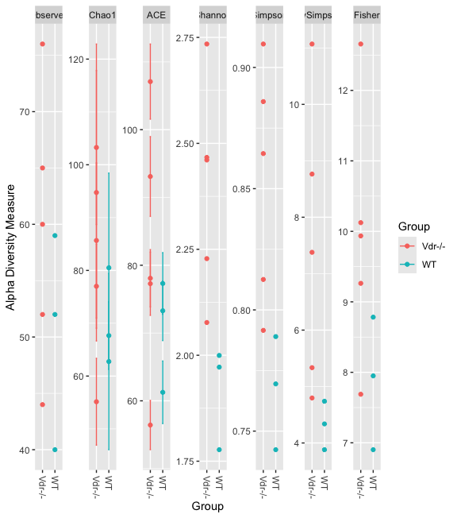

# Demonstration 6                      
Complete the following demonstration in RStudio. Create a markdown file of your script. You can follow detail instructions in Xia et al. (2018), Chapter 7: Exploratory Analysis of Microbiome Data and Beyond. All the sections below match the sections in the book

# Exploratory Analysis of Microbiome Data and Beyond 

## 7.2 Exploratory Analysis with Graphic Summary
```r
# load RDS (R Data Serialization) file 
# An RDS file is a binary file format for storing data in R that's highly compressed and can be read quickly
readRDS(file = "Demo6a.RDS") -> physeq
physeq
sample_variables(physeq)

# 7.2.1 Plot Richness
library(ggplot2)
plot_richness(physeq, x = "Group ", color = "Group ")
```

```r
plot_richness(physeq, measures = c("Chao1", "Shannon"),x = "Group ", color = "Group ")

# 7.2.2 Plot Abundance Bar
theme_set(theme_bw())
plot_bar(physeq)
plot_bar(physeq, fill="Group")

TopNGenus <- names(sort(taxa_sums(physeq), TRUE)[1:5])
Top5Genus  <- prune_taxa(TopNGenus, physeq)

plot_bar(Top5Genus, fill="Group", facet_grid=~Group)

# 7.2.3 Plot Heat Map                                                                      
TopNGenus <- names(sort(taxa_sums(physeq), TRUE)[1:5])
Top5Genus  <- prune_taxa(TopNGenus, physeq)

plot_heatmap(Top5Genus) 

# 7.2.4	Plot Network
set.seed(123)
library(igraph)
ig <- make_network(physeq, max.dist=0.8)
plot_network(ig, physeq, color="Group", shape="Group")

# create a network based on a maximum distance between connected nodes of 0.5
plot_net(physeq, maxdist = 0.5, color = "Group", shape="Group")

# 7.2.5	Plot Phylogenetic Tree

# Add a random phylogenetic tree component
library("ape")
random_tree = ape::rtree(ntaxa(physeq), rooted=TRUE, tip.label=taxa_names(physeq))

# Now merge the tree data to the phyloseq object we already have by using the merge_phyloseq()
ps = merge_phyloseq(physeq, random_tree)
ps

# Use only the first 50 OTUs
psp = prune_taxa(taxa_names(ps)[1:50], ps) 

plot_tree(psp, ladderize = "left", color = "Group") 
plot_tree(psp, ladderize = "left", color = "Group",shape = "Group") 
plot_tree(psp, color = "Group", 
          shape = "Group", ladderize = "left") + coord_polar(theta = "y")
```
### other taxon abundance bar plots
```r
# load RDS file
readRDS(file = "Demo6b.RDS") -> physeq
physeq
sample_variables(physeq)

# list taxonomic ranks
rank_names(physeq, errorIfNULL=TRUE)

# agglomerate by phylum
byphylum <- tax_glom(physeq, taxrank = "Phylum")

# estimate relative proportions
byphylum.tr <- transform_sample_counts(byphylum, function (x) x/sum(x))

# option 1: bar plot

p<-plot_bar(byphylum.tr, x="sampleID", fill="Phylum") + geom_bar(aes(color=Phylum, fill=Phylum), stat="identity", position="stack")
p
p<-plot_bar(byphylum.tr, x="region", fill="Phylum") + geom_bar(aes(color=Phylum, fill=Phylum), stat="identity", position="stack")
p

# option 2: bar plot

# list the ggplot elements
myTheme <- list(geom_bar(stat = "identity", color = "black"),
                panel_border(size = 0.75, colour = "black"),
                theme(axis.text.x = element_text(angle = 90, hjust = 1, vjust = 0.5, size = 10)),
                scale_y_continuous(expand = c(0,0), limits = c(0, 1.001)),
                theme(axis.text.y = element_text(size = 18),
                      axis.title = element_text(size = 20),
                      strip.text = element_text(size = 18, margin = margin(0.3,0,0.3,0, "cm")),
                      plot.title = element_text(size = 20),
                      legend.text = element_text(size = 18)),
                labs(x = ""))

# Melt phyloseq data object into a data.frame for producing graphics with ggplot
byphylum.df <- psmelt(byphylum.tr)

# create plot
p <- ggplot(data = byphylum.df, aes(x = sampleID, y = Abundance, fill = Phylum)) +
  facet_grid(~region, space = "free", scales = "free") +  # use ~body*disease1 for extra subdivisions in the bar plot
  labs(title = "by Phylum") +
  scale_fill_brewer(palette="Set1") +
  myTheme
p
```
## 7.3	Clustering                                                                   
```r
# 7.3.2 Load the package and datasets
library(vegan)  

abund_table=read.csv("VdrFecalGenusCounts.csv",row.names=1, check.names=FALSE)
abund_table<-t(abund_table)

# normalize the abundance table using the function decostand() and calculate the Bray-Curtis dissimilarities
abund_table_norm <- decostand(abund_table, "normalize")
bc_dist<- vegdist(abund_table_norm , method = "bray")

# 7.3.2.1 Single Linkage Agglomerative Clustering
cluster_single <- hclust (bc_dist, method = 'single')
plot(cluster_single)

# 7.3.2.2 Complete Linkage Agglomerative Clustering
cluster_complete <- hclust (bc_dist, method = 'complete')
plot(cluster_complete)

# 7.3.2.3 Average Linkage Agglomerative Clustering
cluster_average <- hclust (bc_dist, method = 'average')
plot(cluster_average)

# 7.3.2.4	Ward's Minimum Variance Clustering
cluster_ward <- hclust (bc_dist, method = 'ward.D2')
plot(cluster_ward)

# draw the results together into one diagram using par
par (mfrow = c(2,2))
plot(cluster_single)
plot(cluster_complete)
plot(cluster_average)
plot(cluster_ward)

par (mfrow = c(1,1))
```
## 7.4	Ordination                          

### 7.4.1	Principal Component Analysis (PCA)
```r
abund_table=read.csv("VdrFecalGenusCounts.csv",row.names=1,check.names=FALSE)
abund_table<-t(abund_table)
head(abund_table)

# to use PCA we need to standardize the abundance read data before analysis
stand_abund_table <- decostand(abund_table, method = "total")
PCA <-rda(stand_abund_table)
PCA

# In vegan’s language,“Inertia” is the general term of“variation” in the data. Total variation of the whole dataset is 0.0408 in this case, and the rst axis explains 60.4% of total variation (0.02029/0.0408 = 0.4973). Total variation is a sum of variations of each genus in analyzed matrix.

# check the total variance
sum (apply (stand_abund_table, 2, var))

# create a biplot
biplot(PCA, display = 'species')

# The above diagrams plotted by biplot() is just drawing arrows for genus, which is not informative.

ordiplot(PCA, display = "sites", type = "text")

# The more informative plot is to use function ordiplot() to draw both genus and sample scores as centroids as below
```
## Other ordination methods
```r
# Other ordination methods required distances instead of proportions
readRDS(file = "Demo6a.RDS") -> ps
ps
sample_variables(ps)

# Estimate distances
brayd<-phyloseq::distance(ps, method="bray")

# Estimate a Principal Coordinate Analysis (PCoA)
p1 = phyloseq::plot_ordination(ps, ordinate(ps, method="PCoA", dist="brayd"), type = "samples", color = "Group") +
  geom_point(size = 3) + ggtitle("PCoA Bray-Curtis")
p1

# First axis explains 48.5% variations of the data, the second axis 19.4%. 

# Estimate a NMDS analysis
p2 = phyloseq::plot_ordination(ps, ordinate(ps, method="NMDS", dist="bray"), type = "samples", color = "Group") +
  geom_point(size = 3) + ggtitle("NMDS Bray-Curtis")
p2

# The function call produces stress value of 7.57%.
# In NMDS the stress score measures how well the ordination summarizes the distances between samples. It's a key indicator of the ordination's "goodness of fit"
# a stress <0.10 is a Good fit 

plot_grid(p1, p2, ncol = 1, nrows=1, align = "v")

# create PCoA plots for 2 factors using list 

library(cowplot)

myTheme <- list(geom_point(size = 3),
                panel_border(colour = "black", size = 0.75),
                labs(color = "region_c",
                     shape = "gender"))

p1 <- plot_ordination(ps1, ordinate(ps1, method="PCoA", dist="unifrac"), color = "region_c", shape = "gender")  +
  myTheme +
  labs(title = "PCoA unweighted unifrac")
p1

# create a NMDS plots for 2 factors using list

p3 <- plot_ordination(ps1, ordinate(ps1, method="NMDS", dist="unifrac"), color = "region_c", shape = "gender")  +
  myTheme +
  labs(title = "NMDS unweighted unifrac")
p3

# Loop through several ordination plots
dist = "bray"
ord_meths = c("CCA", "NMDS", "RDA", "PCoA")
plist = plyr::llply(as.list(ord_meths), function(i, physeq, dist){
  ordi = ordinate(physeq, method=i, distance=dist)
  plot_ordination(physeq, ordi, "samples", color="Group")
}, ps, dist)
names(plist) <- ord_meths
pdataframe = plyr::ldply(plist, function(x){
  df = x$data[, 1:2]
  colnames(df) = c("Axis_1", "Axis_2")
  return(cbind(df, x$data))
})
names(pdataframe)[1] = "method"
p = ggplot(pdataframe, aes(Axis_1, Axis_2, color=Group, fill=Group)) +
  geom_point(size=4) +
  facet_wrap(~method, scales="free") +
  scale_fill_brewer(type="qual", palette="Set1") +
  scale_colour_brewer(type="qual", palette="Set1")
p

# Print one plot of the loop
p = plist[[2]] + scale_colour_brewer(type="qual", palette="Set1") +
  scale_fill_brewer(type="qual", palette="Set1") +
  geom_point(size=3) # + geom_polygon(aes(fill=Group))
p
```
## Constrained Correspondence Analysis (CCA)
```r
# delete taxa with abundance = 0
ps1 <- prune_taxa(taxa_sums(ps) > 1, ps)
ps1

# extract otu_table
otu_c<-as.data.frame(otu_table(ps1))
head(otu_c)

# extract metadata
meta <- meta(ps1)
head(meta)

# estiate CCA
cca1<-cca(otu_c~Group, data=meta)
cca1

# Intrepretation: how variable "Group" impacts microbial community composition accordign to CCA
The total variation (i.e., Inertia) before the matrix is subjected to weighted regression is 0.4955; this is the variation in the data that could be explained
The variation in the community matrix that is explained after weighted regression is 0.1707; this is the variation explained by the axes in the CCA
The variance of the residuals of the regression is 0.3248; this is the variation not explained by the axes in the CCA
Hence 0.1707/0.4955=0.345 (34.5%) of the total variation in the data was captured in the CCA by the "Group" variable
```
# core microbiome: determine the core using the microbime package
```r
library(microbiome)
library(knitr)

readRDS(file = "Demo6b.RDS") -> ps
ps

# identify core microbial species (ASVs) with a 90% prevalence
ps.core <- core(ps, detection = 0, prevalence = 0.9)
core.taxa <- taxa(ps.core);core.taxa

# get their taxonomy
tax.mat <- tax_table(ps.core)
tax.df <- as.data.frame(tax.mat)

# add the ASVs to last column
tax.df$ASV <- rownames(tax.df)

# select taxonomy of only those ASVs that are core members based on the thresholds that were used
core.taxa.class <- dplyr::filter(tax.df, rownames(tax.df) %in% core.taxa)
knitr::kable(head(core.taxa.class))
knitr::kable(core.taxa.class)
```
