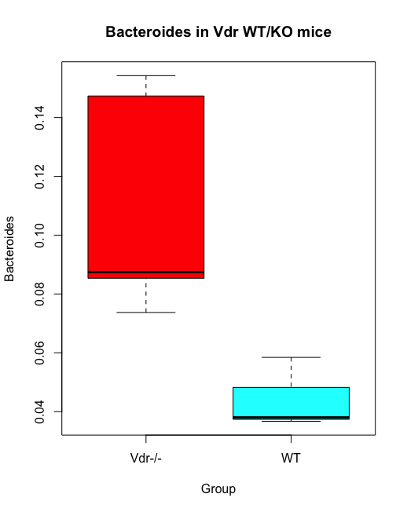

# Demonstration 7
Complete the following demonstration in RStudio. You can follow detail instructions in Xia et al. (2018), Chapters 8 and 9: Univariate Community Analysis and Multivariate Community Analysis. All the sections below match the sections in the book

# Univariate Community Analysis

## 8.1 Comparisons of Diversities between Two Groups 

### 8.1.1 Two-sample Welch's t-test
```r
Fecal_G=read.csv("diver.csv",row.names=1,check.names=FALSE)
Fecal_G

library(ggplot2)

p<-ggplot(Fecal_G, aes(x=value))+
  geom_histogram(color="black", fill="black")+
  facet_grid(Group ~ .)
p

library(plyr)
mu <- ddply(Fecal_G, "Group", summarise, grp.mean=mean(value))
head(mu)

p+geom_vline(data=mu, aes(xintercept=grp.mean, color="red"),
             linetype="dashed")

fit_t <- t.test(value ~ Group, data=Fecal_G,alternative="two.sided")
fit_t
```
### 8.1.2 Wilcoxon Rank Sum Test
```r
fit_w <- wilcox.test(value ~ Group, data=Fecal_G)
fit_w 
```
## 8.2 Comparisons of a Taxon of Interest between Two Groups                                                                     

### 8.2.1 Comparison of Relative Abundance using Wilcoxon Rank Sum Test
```r
abund_table=read.csv("VdrGenusCounts.csv",row.names=1,check.names=FALSE)
abund_table<-t(abund_table)

# check total abundance in each sample
apply(abund_table,1, sum)

# calculate relative abundance
relative_abund_table <- decostand(abund_table, method = "total")

# Check the total abundance in each sample to make the above calculations are correct
apply(relative_abund_table, 1, sum)

# Take a look at the transformed data
relative_abund_table[1:16,1:8]

# subset Bacteroides in column 8
(Bacteroides <-relative_abund_table[,8]) 

# combine Bacteroides and grouping data frames
Bacteroides_G <-cbind(Bacteroides, Fecal_G)
rownames(Bacteroides_G)<-NULL
Fecal_Bacteroides_G <- subset(Bacteroides_G, Location=="Fecal")
Fecal_Bacteroides_G

# generate box plot
boxplot(Bacteroides ~ Group,data=Fecal_Bacteroides_G, col=rainbow(2),main="Bacteroides in Vdr WT/KO mice")
```

```r
ggplot(Fecal_Bacteroides_G, aes(x=Group, y=Bacteroides,col=factor(Group))) + 
  geom_boxplot(notch=FALSE)

fit_w_b <- wilcox.test(Bacteroides ~ Group,data=Fecal_Bacteroides_G)
fit_w_b
```
### boxplot with statistical analysis and significance
```r
library(ggpubr)
library(ggplot2)

# create the groups to compare
my_comparisons <- list( c("Vdr-/-", "WT"))

# run Wilcoxon Rank Sum Test
compare_means(formula = Bacteroides~Group, data = Fecal_Bacteroides_G, method = "wilcox.test", exact= FALSE)

# create box plot
p <- ggplot(Fecal_Bacteroides_G, aes(factor(Group), Bacteroides)) +
    geom_boxplot(aes(fill = factor(Group)),outlier.colour = "black", outlier.size = 0.2)+ geom_jitter(size=0.2,shape=1)+panel_border(colour = "black", size = 0.5)+ ggtitle("Species richness")+labs(y = "Species richness") + stat_compare_means(mapping = NULL, comparisons = my_comparisons, hide.ns = FALSE, label = "p.signif",  label.x = NULL, label.y = NULL, exact =FALSE)
p
```


### 8.2.2 Comparison of Present or Absent Taxon using Chi-square Test
```r
abund_table[1:16,1:27]
(Parabacteroides <- abund_table[,27])

Parabacteroides_G <-cbind(Parabacteroides, Fecal_G)
rownames(Parabacteroides_G)<-NULL

Cecal_Parabacteroides_G <- subset(Parabacteroides_G, Location=="Cecal")
Cecal_Parabacteroides_G

Cecal_Parabacteroides_G$Present <- ifelse((Cecal_Parabacteroides_G$Parabacteroides > 0), "Present","Absent")
Cecal_Parabacteroides_G

library(MASS) 
tbl = table(Cecal_Parabacteroides_G$Group, Cecal_Parabacteroides_G$Present) 
tbl                 
chisq.test(tbl) 

# we can not reject the null hypothesis of no difference between the two groups

# Since Chi-square test may be incorrect, we can applied a Fisher’s exact test

fisher.test(tbl)
```
## 8.3 Comparisons among More Than Two Groups Using ANOVA

### 8.3.1 One-way ANOVA 
```r
# The following codes make a dataframe of Chao1 richness and add group information into this dataframe
CH=estimateR(abund_table)[2,] 
df_CH <-data.frame(sample=names(CH),value=CH,measure=rep("Chao1",length(CH)))
Fecal_G_S <- dplyr::select(Fecal_G, Location, Group)
df_CH_G <-cbind(df_CH, Fecal_G_S)
rownames(df_CH_G)<-NULL
df_CH_G

# create a new four levels group using interaction of Location and Group
df_CH_G$Group4<- with(df_CH_G, interaction(Location,Group))
df_CH_G

boxplot(value~Group4, data=df_CH_G, col=rainbow(4), main="Chao1 index")
```


To apply ANOVA we must first test for normality and homogeneity of variances (homoscedasticity) using the Shapiro-Wilk test and the Bartlett test or Fligner-Killeen tests, respectively 
```r
library(dplyr)
df_CH_G4 <- dplyr::select(df_CH_G, Group4,value)
df_CH_G4

# Shapiro-Wilk normality test
shapiro.test(df_CH_G4$value)

# Bartlett test of homogeneity of variances
bartlett.test(value~Group4, data=df_CH_G4) 
qchisq(0.95, 1)

# Because Chi-squared is less than Bartlett’s K-squared, we reject the null hypothesis and conclude that the variances are not same.

# We now use Fligner-Killeen test to check the homoscedasticity
fligner.test(df_CH_G4, Group4)
# the variances are not the same

# Conclusion: AVOVA should not be applied

# However, for the purpose of illustration, we proceed to analyze the data by ANOVA regardless of the test results of homegeneity of variances.
aov_fit <- aov(value~Group4,data=df_CH_G) 
summary(aov_fit, intercept=T) 

# Since p-value > 0.05, we accept the null hypothesis H0: the four means are not different
```
### 8.3.2 Pairwise and Tukey Multiple Comparisons

The ANOVA results give the overall test of group difference (in this case, 4 groups with fecal, cecal, Vdr−/−, and WT combination). Our purpose is to also test each pair difference associated with Chao 1 richness. The following steps are to illustrate the capabilities of pairwise t-test and Tukey’s ad hoc multiple comparisons in R.
```r
#Pairwise tests of mean differences
pairwise.t.test(df_CH_G$value, df_CH_G$Group4, p.adjust="none", pool.sd = T) 
 
#conservative Bonferroni adjustment
pairwise.t.test(df_CH_G$value, df_CH_G$Group4, p.adjust="bonferroni", pool.sd = T)

#Holm method 
pairwise.t.test(df_CH_G$value, df_CH_G$Group4, p.adjust="holm", pool.sd = T)

#Benjamini & Hochberg(BH)
pairwise.t.test(df_CH_G$value, df_CH_G$Group4, p.adjust="BH", pool.sd = T)

#Benjamini & Yekutieli
pairwise.t.test(df_CH_G$value, df_CH_G$Group4, p.adjust="BY", pool.sd = T)

#Tukey multiple comparisons of means
TukeyHSD(aov_fit, conf.level=.95)  

plot(TukeyHSD(aov(df_CH_G$value~df_CH_G$Group4), conf.level=.95))
```


## 8.4 Comparisons among More than Two Groups Using Kruskal-Wallis Test                           

### 8.4.2 Compare Diversities among Groups
```r
library(dplyr)
Data <- mutate(df_CH_G, Group = factor(df_CH_G$Group4, levels=unique(df_CH_G$Group4)))

library(FSA)
Summarize(value ~ Group4, data = df_CH_G)

#Individual plots in panel of 2 columns and 2 rows
library(lattice)
histogram(~ value|Group4, data=df_CH_G,layout=c(2,2)) 

#kruskal wallis test of Chao 1 richness
kruskal.test(value ~ Group4, data = df_CH_G) 

# if the Kruskal-Wallis test is significant and for the purpose of illustration, we perform a post hoc analysis to assess which levels of the groups are different from each other 

# Tukey test
library(DescTools)
#Tukey method for adjusting p-values
Test_N = NemenyiTest(x = df_CH_G$value,
                 g = df_CH_G$Group4,
                 dist="tukey")
Test_N

# Dunn test
library(FSA)

# "bh" suggests Benjamini and Hochberg  method for adjusting p-values
Test_N = dunnTest(df_CH_G$value ~ df_CH_G$Group4,data=df_CH_G, method="bh")
Test_N
  ```            
### 8.4.3 Find Significant Taxa among Groups  
```r
# normalize the abundance data by estimating relative abundances and convert the data to a data frame
df<-as.data.frame(abund_table/rowSums(abund_table))
df

KW_table <- data.frame()
for (i in 1:dim(df)[2]) {
  #run KW test for each bacterium
  KW_test <- kruskal.test(df[,i], g=df_CH_G$Group4)
  # Store the result in the data frame
  KW_table <- rbind(KW_table,
                    data.frame(id=names(df)[i],
                    p.value=KW_test$p.value
                                ))
  # Report number of bacteria tested
  cat(paste("Kruskal-Wallis test for ",names(df)[i]," ", i, "/", 
            dim(df)[2], "; p-value=", KW_test$p.value,"\n", sep=""))
}

#Check the data frame table
head(KW_table)
```
### 8.4.4 Multiple Testing via FDR: False Discovery Rate (Benjamini and Hochberg, 1995)
```r
#order p-values from smallest to largest
KW_table <- KW_table[order(KW_table$p.value, decreasing=FALSE), ]
head(KW_table)

#calculate q-value using formula q-value= p - value x T/k
KW_table$q.value.factor <- dim(KW_table)[1] / 1:dim(KW_table)[1]
head(KW_table$q.value.factor)

KW_table$q.value <- KW_table$p.value * KW_table$q.value.factor
head(KW_table$q.value)

#check to see if q-value added to the result data frame
head(KW_table)

#set up alpha value
KW_alpha=0.05

#identify the last item of the ranked list with a q-value =< alpha 
last.significant.item <- max(which(KW_table$q.value <= KW_alpha))
last.significant.item

# there are no q-value less than or equal to the speci ed alpha, so the program returns negative infinite
```
# Multivariate Community Analysis

## 9.1 Hypothesis Testing among Groups using Permutational Multivariate Analysis of Variance (PERMANOVA)

### 9.1.2 Implementing PERMANOVA using vegan Package
```r
# Load microbial abundances
abund_table=read.csv("VdrGenusCounts.csv",row.names=1,check.names=FALSE)
abund_table<-t(abund_table)

# estimate Bray-Curtis dissiimilarity
library(vegan)
bray<-vegdist(abund_table, "bray")

# Load metadata
grouping=read.csv("diver.csv",row.names=1,check.names=FALSE)
grouping

set.seed(123)

# Test Difference of the Bray-Curtis Dissimilarity Between Groups using PERMANOVA test (adonis)
adonis2(bray ~ Group,data=grouping,permutations = 1000) 

# same as above if Bray-Curtis dissimilarity is not given
adonis2(abund_table ~ Group,data=grouping,permutations = 1000, method = "bray") 

adonis2(bray ~ Location,data=grouping,permutations = 1000) 

# same as above 
adonis2(bray ~ grouping$Location,permutations = 1000) 
```
## 9.3 Hypothesis Tests among-Group Differences using Analysis of Similarity (ANOSIM)
```r
anosim(bray, grouping$Group,permutations = 1000)
anosim(abund_table, grouping$Group, permutations = 1000, distance = "bray")
fit <- anosim(bray, grouping$Group,permutations = 1000)
summary(fit)

plot(fit)
```


## 9.4 Hypothesis Tests of Multi-Response Permutation Procedures (MRPP)
```r
mrpp(bray, grouping$Group,permutations = 1000)
mrpp(abund_table, grouping$Group, permutations = 1000, distance = "bray")
```
