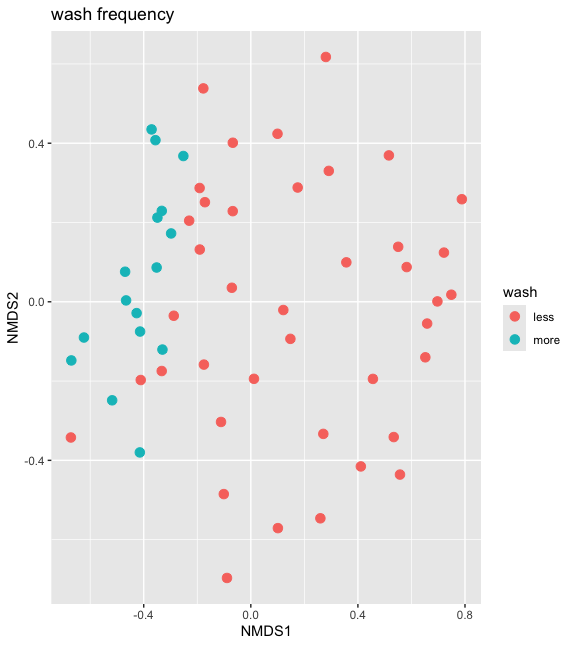
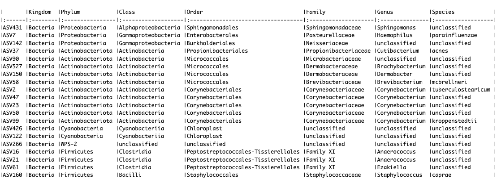

# Demonstration 8
Complete the following demonstration of a random forest analysis in RStudio. Random forest is a powerful machine learning algorithm for classification and identification of predictive features or biomarkers (e.g., mcirobial taxa). It operates by constructing a multitude of decission trees (i.e., forests) at training time and predicting the class as the majority vote of the individual trees. 

# Machine learning approaches for microbiome analysis
```r
# load data
ps1<-readRDS(file="ps1.RDS")
ps1
sample_variables(ps1)

# To get a sense of how these samples differ at the ASV level, let’s make an NMDS to look at the bray-curtis dissimilarity of the wash groups we want to compare below
bray.nmds <- ordinate(physeq = ps1, method = "NMDS", distance = "bray")

# Plot NMDS and color samples by wash
plot_ordination(
  physeq = ps1, 
  ordination = bray.nmds, 
  color = "wash"
) + 
  geom_point(size = 3) + 
  ggtitle("wash frequency")

# both groups look very distinct 
```


A random forest analyses should be able to pull out the key ASVs that separate these two groups and accurately classify them

Random forest analyses can be used for both classification and regression; the key difference between classification and regression lies in the type of target variable you're predicting: classification tasks aim to predict a categorical outcome (like "healt" or "disease") by taking a majority vote across the decision trees, while regression tasks predict a continuous numerical value by averaging the predictions from each tree. Essentially, classification is about assigning data points to distinct categories, while regression predicts a specific value on a continuous scale.

## Random Forest Approach for Classification
```r
# Make a dataframe of training data with OTUs as column and samples as rows
predictors <- t(otu_table(ps1))
dim(predictors)

# Make one column for the outcome/response categorical variable "wash" in ps1.RDS
response <- as.factor(sample_data(ps1)$wash)

# Combine them into 1 data frame
rf.data <- data.frame(response, predictors)
```
Now we will use the randomForest package to train and test our random forest model using the “out of bag” error to estimate our model error. OOB is a nice feature of random forest models whereby since the training data is bootstrapped, you only use approximately 2/3 of the data at each iteration. The remaining 1/3 or “out of bag” data (test data) can be used to validate your model. This removes the need to use another form of cross-validation such as using a separate validation set or k-folds. The out-of-bag error then is a performance metric that estimates the performance of the Random Forest model using samples not included in the bootstrap sample for training, i.e., the test data.

```r
install.packages("randomForest")
library(randomForest)
library(knitr)
library(dplyr)
```
It is important to set a seed for reproducability. By default, randomForest uses p/3 variables when building a random forest of regression trees and root(p) variables when building a random forest of classification trees. In this case, p=number of ASVs, hence 329/3 = 110
```r
set.seed(2)
skin.classify <- randomForest(response~., data = rf.data, ntree = 1000)
print(skin.classify)

# the OOB estimate of  error rate was ~16%. 
```
In most statistical learning algorithms, the data needs to be split up into “training” and “test” data. The idea is to train the model on one set of data and test it on a naive set of data. Random forests are nice because you have a built-in way of estimating the model error. Since only ~2/3 of the data is used everytime we bootstrap our samples for construction of the kth tree, we can use the remaining ~1/3 of the data (called the out of bag samples) to test model error 

An "acceptable" OOB (out-of-bag) error rate depends heavily on the specific problem domain and desired accuracy, but generally, an OOB error rate below 30% is considered acceptable for most classification tasks; for highly complex problems or situations requiring very high precision, a lower OOB error rate would be preferable
```r
# What variables are stored in the output?
names(skin.classify)
```
Plots: lets make some plots of the most important variables in our model. For a classification tree, variable importance is measured by mean decrease in GINI coefficient (measure of node purity) due to that variable
```r
# Make a data frame with predictor names and their importance
imp <- importance(skin.classify)
imp <- data.frame(predictors = rownames(imp), imp)

# Order the predictor levels by importance, higher value mean more important:
imp.sort <- arrange(imp, desc(MeanDecreaseGini))
imp.sort$predictors <- factor(imp.sort$predictors, levels = imp.sort$predictors)

# Mean Decrease Gini (MDG) is a measure of how important a variable is in a random forest model. It measures how much a variable decreases the Gini impurity, which is a way to calculate the probability of misclassifying a data point

# Select the top 20 predictors
imp.20 <- imp.sort[1:20, ]

# ggplot
ggplot(imp.20, aes(x = predictors, y = MeanDecreaseGini)) +
  geom_bar(stat = "identity", fill = "indianred") +
  coord_flip() +
  ggtitle("Most important OTUs for classifying skin samples\n into more washed or less washed")
```

```r
# What are those ASVs?
otunames <- imp.20$predictors
r <- rownames(tax_table(ps1)) %in% otunames
kable(tax_table(ps1)[r, ])
```


Now we could look into the literature to see what is known about these biomarker taxa

## Random Forest Approach for Regression
```r
# Make a dataframe of training data with OTUs as column and samples as rows
predictors <- t(otu_table(ps1))
dim(predictors)

# Make one column for the outcome/response continuous variable "age" in ps1.RDS
response <- as.numeric(sample_data(ps1)$age)

#or

response <- get_variable(ps1, "age")

# Combine them into 1 data frame
rf.data <- data.frame(response, predictors)

# ran randomForest
set.seed(2)
skin.classify <- randomForest(response~., data = rf.data, ntree = 1000)
print(skin.classify)

# What variables are stored in the output?
names(skin.classify)

# make a plot of the most important variables in our model

# Make a data frame with predictor names and their importance
imp <- importance(skin.classify)
imp <- data.frame(predictors = rownames(imp), imp)

# Order the predictor levels by importance, higher value mean more important:
imp.sort <- arrange(imp, desc(IncNodePurity))
imp.sort$predictors <- factor(imp.sort$predictors, levels = imp.sort$predictors)

# IncNodePurity: Increase in Node Purity, measures how well a predictor decreases variance

# Select the top 20 predictors
imp.20 <- imp.sort[1:20, ]

# ggplot
ggplot(imp.20, aes(x = predictors, y = IncNodePurity)) +
  geom_bar(stat = "identity", fill = "indianred") +
  coord_flip() +
  ggtitle("Most important OTUs for classifying skin samples\n into more washed or less washed")
```

```r
# What are those ASVs?
otunames <- imp.20$predictors
r <- rownames(tax_table(ps1)) %in% otunames
kable(tax_table(ps1)[r, ])
```

