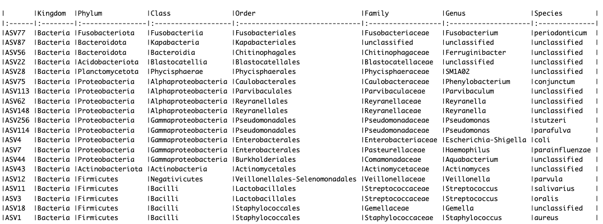

# Demonstration 8
Complete the following demonstration in RStudio. 

# Machine learning approaches for microbiome analysis
```r
# load data
ps1<-readRDS(file="ps1.RDS")
ps1
sample_variables(ps1)

# Make a dataframe of training data with OTUs as column and samples as rows
predictors <- t(otu_table(ps1))
dim(predictors)

# Make one column for our outcome/response variable wash in ps1.RDS
response <- as.factor(sample_data(ps1)$wash)

# Combine them into 1 data frame
rf.data <- data.frame(response, predictors)
```
Now we will use the randomForest package to train and test our random forest model using the “out of bag” error to estimate our model error. OOB is a nice feature of random forest models whereby since the training data is bootstrapped, you only use approximately 2/3 of the data at each iteration. The remaining 1/3 or “out of bag” data can be used to validate your model. This removes the need to use another form of cross-validation such as using a separate validation set or k-folds
```r
install.packages("randomForest")
library(randomForest)
library(knitr)
library(dplyr)
```
It is important to set a seed for reproducability. By default, randomForest uses p/3 variables when building a random forest of regression trees and root(p) variables when building a random forest of classification trees. In this case, p/3 = 129
```r
set.seed(2)
skin.classify <- randomForest(response~., data = rf.data, ntree = 1000)
print(skin.classify)
```
In most statistical learning algorithms, the data needs to be split up into “training” and “test” data. The idea is to train the model on one set of data and test it on a naive set of data. Random forests are nice because you have a built-in way of estimating the model error. Since only ~2/3 of the data is used everytime we bootstrap our samples for construction of the kth tree, we can use the remaining ~1/3 of the data (called the out of bag samples) to test model error
```r
# What variables are stored in the output?
names(skin.classify)
```
Plots: lets make some plots of the most important variables in our model. For a classification tree, variable importance is measured by mean decrease in GINI coefficient (measure of node purity) due to that variable
```r
# Make a data frame with predictor names and their importance
imp <- importance(skin.classify)
imp <- data.frame(predictors = rownames(imp), imp)

# Order the predictor levels by importance, higher value mean more important:
imp.sort <- arrange(imp, desc(MeanDecreaseGini))
imp.sort$predictors <- factor(imp.sort$predictors, levels = imp.sort$predictors)

# Select the top 10 predictors
imp.20 <- imp.sort[1:20, ]

# ggplot
ggplot(imp.20, aes(x = predictors, y = MeanDecreaseGini)) +
  geom_bar(stat = "identity", fill = "indianred") +
  coord_flip() +
  ggtitle("Most important OTUs for classifying skin samples\n into more washed or less washed")
```

```r
# What are those ASVs?
otunames <- imp.20$predictors
r <- rownames(tax_table(ps1)) %in% otunames
kable(tax_table(ps1)[r, ])
```

