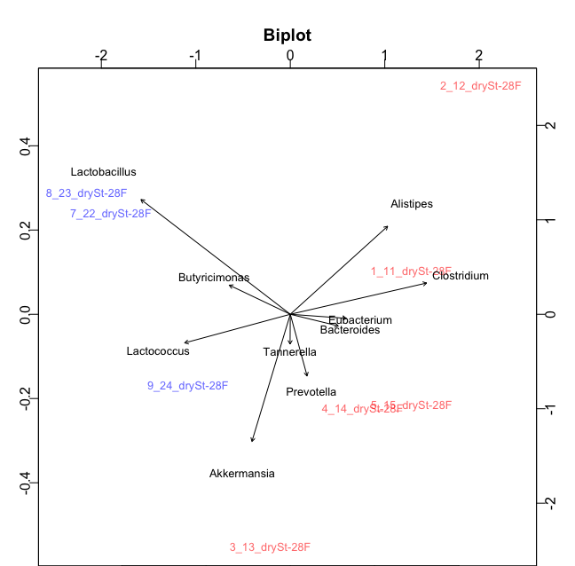
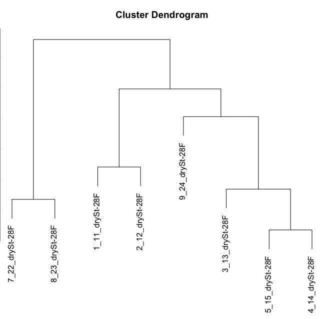
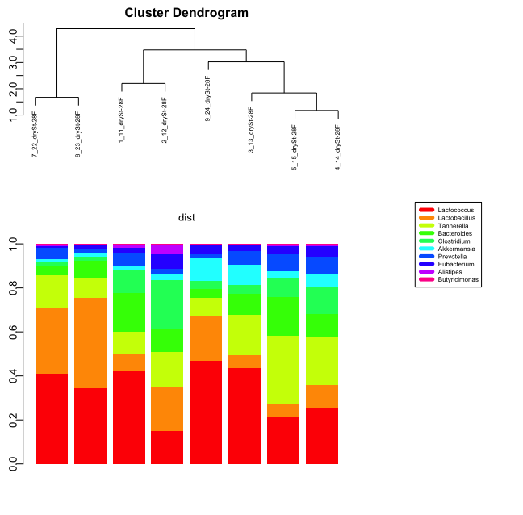
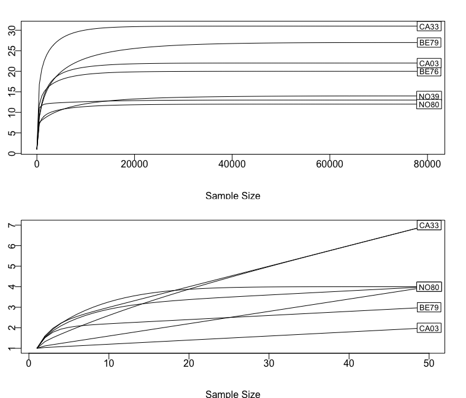

# Demonstration 9
Complete the following demonstration in RStudio. You can follow detail instructions in Xia et al. (2018), Chapter 10: Compositional Analysis of Microbiome
Data. All the sections below match the sections in the book

# Chapter 10: Compositional Analysis of Microbiome Data 

## 10.3. Exploratory Compositional Data Analysis                                 

### 10.3.1 Compositional Biplot 

The compositional biplot is one of the most widely used tools for exploring multivariate compositional data. The plot can show whether or not the samples separate into different groups; what taxa are driving this separation and what taxa are irrelevant to the analysis. 

We illustrate the compositional biplot step-by-stepas below:
```r
library(dplyr)
data=read.csv("VdrFecalGenusCounts.csv",row.names=1,check.names=FALSE)

# eliminate bacteria (rows) with all zeros 
abund_table <- data %>%
  filter(rowSums(select_if(., is.numeric) != 0) > 0)

abund_table_t<-t(abund_table)
head(abund_table_t)

# Replace 0 Values Using the zCompositions Package
# This function expects the samples to be in rows and taxa (or OTUs) to be in columns. Because the abund_table_t dataset already have the appropriate data format, we directly use here. But in order to convert the count data to proportion, we use the t() function to transpose the data back to taxa by samples format.
#install.packages("zCompositions")

library (zCompositions)
abund_table_r <- t(cmultRepl((abund_table_t), method="CZM", output="p-counts"))
head(abund_table_r)

# Convert the Data to Proportions
abund_table_prop <- apply(abund_table_r, 2, function(x){x/sum(x)})
head(abund_table_prop)

# filter the data to remove all taxa that are less than 0.1% abundance in any sample using the function apply() again.
abund_table_prop_f<- abund_table_r[apply(abund_table_prop, 1, min) > 0.001,]
head(abund_table_prop_f)

# Perform the clr Data Transformation
names_add <- rownames(abund_table_prop_f)[
  order(apply(abund_table_prop_f, 1, sum), decreasing=T) ]

abund_table_prop_reduced <- abund_table_prop_f[names_add,]
head(abund_table_prop_reduced)

abund_clr <- t(apply(abund_table_prop_reduced, 2, function(x){log(x) - mean(log(x))}))
head(abund_clr)

# Perform the Singular Value Decomposition Using the Function prcomp()
abund_PCX <- prcomp(abund_clr)
abund_PCX$x 

# Display the Results of Principal Component Analysis by Using biplot()
library(compositions)
#Sum the total variances
sum(abund_PCX$sdev[1:2]^2)/mvar(abund_clr)

# the total variance explained by the first two principal components (PC) is 68.94% 

samples <- c(rep(1, 5,rownames(abund_PCX$x)),
    rep(2, 3,rownames(abund_PCX$x))) 

palette=palette(c(rgb(1,0,0,0.6), rgb(0,0,1,0.6), rgb(.3,0,.3,0.6)))
palette
par (mfrow = c(1,1))
coloredBiplot(abund_PCX, col="black", cex=c(0.8, 0.8),xlabs.col=samples, 
              arrow.len=0.05,
              xlab=paste("PC1 ", round (sum(abund_PCX$sdev[1]^2)/mvar(abund_clr),3), sep=""),
              ylab=paste("PC2 ", round (sum(abund_PCX$sdev[2]^2)/mvar(abund_clr),3), sep=""),
              expand=0.8,var.axes=T, scale=1, main="Biplot")
```


The Vdr−/− and WT samples are separated very well: 3 wild types (in blue) on the left and 5 Vdr−/− (in red) on the right
The first two components explained 69% of the total variance (42.7% for component 1, 26.3% for component 2) in the dataset 
The length and direction of the arrows (taxa location) is proportional to the standard deviation of the taxon in the dataset. Lactobacillus is a highly variable genus along the same direction as samples 22 and 23, which indicates that this bacterial is more abundant in WT samples than in Vdr−/− samples.
    
### 10.3.3 Compositional Cluster Dendrogram
```r
# generate the distance matrix
dist <- dist(abund_clr, method="euclidian")

# cluster the data
hc <- hclust(dist, method="ward.D2")
hc
# plot the dendrogram
plot(hc, cex=1.0)
```


### 10.3.4 Compositional Barplot
```r
re_order <- abund_table_prop_reduced[,hc$order]
re_order

library(compositions)
re_order_acomp <- acomp(t(re_order))
par(mfrow=c(1,2))
#par(mar=c(3,1,1,1)+0.8)
colours <- rainbow(10)
# plot the barplot below
barplot(re_order_acomp, legend.text=F, col=colours, axisnames=F, border=NA, xpd=T)
# and the legend
plot(1,2, pch = 1, lty = 1, ylim=c(-10,10), type = "n", axes = FALSE, ann = FALSE)
legend(x="center", legend=names_add, col=colours, lwd=5, cex=.6, border=NULL)

# plot the dendrogram and barplot together
layout(matrix(c(1,3,2,3),2,2, byrow=T), widths=c(5,2), height=c(3,4))
par(mar=c(3,1,1,1)+0.8)

# plot the dendrogram
plot(hc, cex=0.6)

# plot the barplot below
barplot(re_order_acomp, legend.text=F, col=colours, axisnames=F, border=NA, xpd=T)

# and the legend
plot(1,2, pch = 1, lty = 1, ylim=c(-10,10), type = "n", axes = FALSE, ann = FALSE)
legend(x="center", legend=names_add, col=colours, lwd=5, cex=.6, border=NULL)

par (mfrow = c(1,1))
```


## 10.4.Comparison between the Groups Using ALDEx2 Package

ALDEx2: Analysis Of Differential Abundance Taking Sample and Scale Variation Into Account
read more at https://www.bioconductor.org/packages/release/bioc/html/ALDEx2.html
```r
BiocManager::install("ALDEx2")
library(ALDEx2)

data=read.csv("VdrSitesGenusCounts.csv",row.names=1,check.names=FALSE)

# eliminate bacteria (rows) with all zeros 
abund_table <- data %>%
  filter(rowSums(select_if(., is.numeric) != 0) > 0)

abund_table_t<-t(abund_table)

#  extract group information from the abundance table and assign a group variable
meta_table <- data.frame(row.names=rownames(abund_table_t),t(as.data.frame(strsplit(rownames(abund_table_t),"_"))))
meta_table

# create groups to compare
groups <- with(meta_table,ifelse(as.factor(X3)%in% c("drySt-28F"),c("VdrFecal"), c("VdrCecal")))
groups

# run ALDEx 

# The function requires the following elements: microbial counts, groups to compare, test to run, and number of Monte-Carlo instances
# The software authors recommend 128 or more mc.samples for the t-test, 1000 for a rigorous effect size calculation.

vdr_t <- aldex(abund_table, groups, mc.samples=128, test="t", effect=TRUE,
                include.sample.summary=FALSE, denom="iqlr", verbose=FALSE)
head(vdr_t)

vdr_t_f <- vdr_t %>% filter(wi.eBH < 0.1)
head(vdr_t_f)
```
we.ep (expected p-value of Welch’s t test)
we.eBH (expected Benjamini-Hochberg corrected p-value of Welch’s t test)
wi.ep (expected p-value of Wilcoxon rank sum test)
wi.eBH (expected Benjamini-Hochberg corrected p-value of Wilcoxon rank sum test).
```r
vdr_kw <- aldex(abund_table, groups, mc.samples=128, test="kw", effect=TRUE,
               include.sample.summary=FALSE, denom="iqlr", verbose=FALSE)
head(vdr_kw)

vdr_kw_f <- vdr_kw %>% filter(glm.eBH < 0.1)
head(vdr_kw_f)
```
kw.ep (expected p-value of Kruskal-Wallis test)
kw.eBH (expected Benjamini-Hochberg corrected p-value of Kruskal-Wallis test)
glm.ep (expected p-value of glm test), and glm.eBH (expectedBenjamini-Hochberg corrected p-value of glm test)

## Rarefaction Analysis

Rarefaction analysis is a technique used to compare the diversity of different samples by adjusting for differences in sample size
Rarefaction analysis involves randomly discarding reads from larger samples to create subsamples of equal size. This allows for the calculation of comparable diversity metrics, which can then be used to compare ecosystems
```r
# load data
ps=readRDS(file="Demo9.RDS")
ps

library(vegan)

par (mfrow = c(2,1))

# rarefy to the minimum sample size
ps1<-rarefy_even_depth(ps, sample.size = min(colSums(otu_table(ps))),replace=FALSE, rngseed=T)
otu.rare = otu_table(ps1)
otu.rare = as.data.frame(t(otu.rare))
otu.rarecurve1 <-rarecurve(otu.rare, step = 500, xlab = "Sample Size", ylab = "ASV", label = T)

# rarefy to a very small saple size size for comparison
ps2<-rarefy_even_depth(ps, sample.size = 50,replace=FALSE, rngseed=T)
otu.rare = otu_table(ps2)
otu.rare = as.data.frame(t(otu.rare))
otu.rarecurve2 <- rarecurve(otu.rare, step = 1, xlab = "Sample Size", ylab = "ASV", label = T)
par (mfrow = c(1,1))
```


The rarefaction curves plateau for all samples in the top plot (i.e., most of the microbial species diversity in the microbiome has been sampled), but not in the bottom plot
